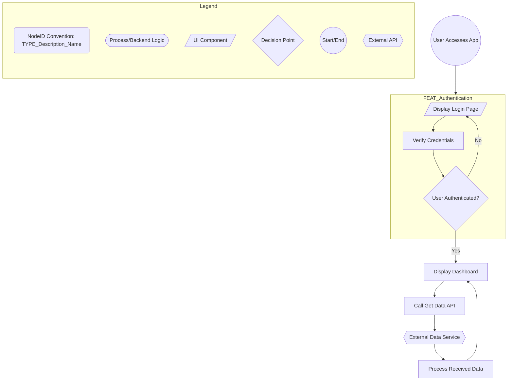

# Noderr v1.9 - Flowchart Generation Guide

**Version:** 1.9
**Date:** 2025-06-10
**Based on:** Architecture generation principles from previous versions
**Target Audience:** Noderr Orchestrator (to guide the AI Agent)
**Purpose:** This document guides the AI Agent to generate or assist in updating the Mermaid flowchart syntax for the `./noderr_architecture.md` file. This flowchart is a critical visual representation of the application's architecture, component interactions, and dependencies within the Noderr v1.9 system.

---

**When this Guide is Used by Noderr Orchestrator:**

1.  **Initial Flowchart Creation:** During "Phase 1: Define, Visualize, Link" of Noderr v1.9, to create the first version of `noderr_architecture.md` based on `noderr_project.md` and/or existing code analysis.
2.  **Major Feature Addition/Refactoring:** When significant new features are added or existing architecture is refactored, requiring substantial updates to the flowchart.
3.  **Flowchart Consistency Review (Assistance):** To help identify or draft syntax for changes needed after a node's implementation reveals architectural discrepancies (as part of the "Check Flowchart Consistency" step in `noderr_loop.md`), especially if changes are complex and flagged for Orchestrator/user review.

**Input Provided by Noderr Orchestrator (will vary by use case):**

*   `ProjectOverviewContext`: Key architectural descriptions, main components, and features from `noderr_project.md`.
*   `ExistingFlowchartContent` (If updating): The current content of `noderr_architecture.md`.
*   `UserRequirementsForChange` (If updating/adding): Specific user requirements for new features or architectural changes to be reflected.
*   `CodeAnalysisSummary` (If generating from code): A summary of key modules, functions, and their apparent interactions based on the Agent's code analysis.
*   `NoderrNodeIDConvention`: The established convention for NodeIDs (e.g., `FEAT_Name`, `API_Name`, as potentially defined in `noderr_project.md` or the legend of an existing flowchart).

**Contextual Files for Agent's Analysis (Use your tools like `str_replace_editor view` and `search_filesystem`):**

*   `./noderr_project.md`: For high-level architecture, components, and features.
*   `./noderr_tracker.md`: To see existing NodeIDs and their labels (though the flowchart is the source of truth for architectural NodeIDs, and the status map is primary for spec links).
*   `./specs/` directory: Specifications of existing components can provide insights into their connections and roles.
*   Relevant source code files (if analyzing existing code).

**Instructions for Agent Generating/Updating Flowchart Mermaid Syntax:**

1.  **Diagram Type:** Use `graph TD` (Top-Down) or `graph LR` (Left-Right) for Mermaid flowcharts, as appropriate for readability or as specified by the Orchestrator or implied by an existing diagram. `graph TD` is a common default.
2.  **Node Definition & NodeIDs:**
    *   Represent all key architectural components, modules, services, UI views, critical functions, or distinct processing stages as nodes.
    *   Assign a **unique, descriptive `NodeID`** to each implementable component represented in the flowchart. Adhere to the established `NoderrNodeIDConvention` if one exists (check existing legend or `noderr_project.md`).
    *   Node labels (the text displayed in the node) should be human-readable and concise (e.g., `NodeID["Descriptive Label"]`). If the `NodeID` itself is sufficiently descriptive, a separate label might be omitted for very simple nodes, but labels are generally recommended.
3.  **Spec Links (in Flowchart - Deprioritized):**
    *   The `./noderr_tracker.md` is the **primary artifact** for managing direct links to `specs/[NodeID].md` files.
    *   **Do not** add spec links to the flowchart unless explicitly instructed by the Orchestrator. The flowchart's purpose is to show architecture, not to be a navigation hub.
4.  **Connections & Flow Logic:**
    *   Use arrows (`-->`) to show the direction of data flow, control flow, or dependency.
    *   Label connections clearly if the relationship is not obvious or if it represents a condition (e.g., `-->|User Authenticated? Yes| NodeA`, `-->|No| NodeB`).
    *   Use diamond shapes for decision points (e.g., `DecisionNode{Is user admin?}`).
5.  **Grouping with Subgraphs:**
    *   Use `subgraph SubgraphName ... end` to group related components or logical parts of the application (e.g., "Authentication Module," "Frontend Components," "Backend API Services"). This greatly improves readability for complex diagrams.
6.  **Styling (Use Consistently and Define in Legend):**
    *   (Optional, but recommended for clarity if different component types exist) Use different node shapes for different types of components. Define these shapes and their meanings clearly in the legend. Common examples:
        *   `NodeID[...]` (Rectangle): Standard processes, backend logic.
        *   `NodeID(...)` (Stadium Shape): Data stores, database operations (often represented as connections rather than standalone nodes unless they are active components).
        *   `NodeID{...}` (Diamond): Decision points.
        *   `NodeID[/...\]` (Parallelogram/Skewed Rectangle): UI components, views, inputs/outputs.
        *   `NodeID[[...]]` (Subroutine Shape): Utility functions or sub-processes if shown as distinct nodes.
        *   `NodeID((...))` (Circle): Start/end points, or sometimes for user roles or external entities.
        *   `NodeID{{...}}` (Hexagon): External services or APIs.
7.  **Legend (CRITICAL):**
    *   **ALWAYS include a `subgraph Legend ... end` section.** This makes the flowchart self-documenting.
    *   The legend **MUST** define:
        *   All node shapes used and their meanings (e.g., `L_Proc([Process/Backend Logic])`).
        *   The `NodeID` naming convention being used, if one is established.
        *   (If used in the flowchart) The syntax or meaning of any special link formats.
        *   Any specific arrow styling or color meanings if used (though keeping styling simple is generally preferred for agent-generated diagrams).
8.  **Readability & Structure:**
    *   Use Mermaid comments (`%% Comment`) to delineate logical sections within the Mermaid syntax itself (e.g., `%% --- User Authentication Flow ---`).
    *   Aim for a clear visual layout. Try to minimize crossing lines where possible (Mermaid's auto-layout will attempt this).
    *   Ensure consistent indentation for subgraphs and nested elements in the Mermaid code for human readability of the source.
9.  **Updating Existing Flowcharts:**
    *   When asked to update, carefully analyze the `ExistingFlowchartContent`.
    *   Make changes by adding, removing, or modifying node definitions and connections as per `UserRequirementsForChange` or `CodeAnalysisSummary`.
    *   Ensure your changes integrate cleanly with the existing diagram structure and maintain overall readability.
    *   If adding new node types or conventions, **update the Legend accordingly.**

**Output Requirement for the Agent:**
*   Your final output for this task is **ONLY** the complete Mermaid flowchart syntax, ready to be saved as or inserted into `noderr/noderr_architecture.md`.
*   Start with `graph TD` (or `graph LR`) and end after the last element of the diagram, including the legend.
*   Do not include any other conversational text, explanations, or Markdown formatting around the Mermaid block itself (unless the entire file content of `noderr/noderr_architecture.md` is requested, in which case it should be pure Markdown with the Mermaid block as its primary content).

---
**Example Snippet (Illustrative - Agent should adapt based on specific project requirements):**

