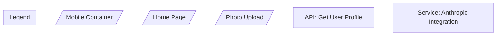

# Noderr: Install and Reconcile

## Context & File Locations

You are working with:
- **Initial planning documents** (used for the first build):
  - Blueprint/design documents (location varies - check conversation history)
  - Original `noderr_project.md` (if created during planning)
  - Original `noderr_architecture.md` (if created during planning)
- **Noderr framework files** (just extracted from ZIP):
  - `noderr/` folder with template files
  - `noderr/specs/` and `noderr/planning/` empty directories
  - `noderr/prompts/` folder with workflow prompts
- **The actual codebase** (what was built from the plans)

## Prerequisites

Before using this prompt, you should have:
1. Completed an initial build based on your blueprint/design documents
2. Extracted the Noderr ZIP file into your project root
3. Access to the original planning documents used for the initial build

## Your Mission

You have just completed an initial build based on blueprint, project, and architecture documents. The Noderr framework ZIP has been extracted into the project. Your task is to install Noderr completely by:

1. Examining what was actually built vs. what was planned
2. Finding ALL existing components and documenting them as NodeIDs
3. Updating all Noderr files to reflect actual reality
4. **Analyzing MVP gaps and adding missing components needed for completion**
5. Creating complete specifications for the entire system (existing + needed)
6. Setting up the environment configuration
7. Delivering a 100% complete, ready-to-develop system

**CRITICAL**: This is a complete installation process. You must find and document everything without any user interaction or approval gates.

---

### Phase 1: Comprehensive Codebase Analysis

#### 1.1 Complete Environment Context (MANDATORY FIRST STEP)

**CRITICAL ENVIRONMENT AWARENESS**: Before running any commands, understand:
- You are documenting the DEVELOPMENT environment you're currently working in
- This is NOT the production/deployed environment
- Example: In Replit, document the workspace preview URL, NOT the .repl.app deployment URL
- Example: In Vercel, document localhost:3000, NOT the .vercel.app URL
- Example: In Lovable, document the preview panel, NOT the deployed instance

**The `environment_context.md` template exists but is unfilled. Complete it following this environment-aware process:**

1. **Read the discovery instructions** in `environment_context.md`
2. **Execute the ENVIRONMENT TYPE CHECK first**:
   ```bash
   echo "=== ENVIRONMENT TYPE CHECK ==="
   echo "Current working directory: $(pwd)"
   echo "Development environment indicators:"
   env | grep -E "REPL|CLOUD|VIRTUAL|AWS|GCP|AZURE|HEROKU|VERCEL|NETLIFY|LOVABLE"
   echo ""
   echo "⚠️ CONFIRMING: I am documenting the DEVELOPMENT workspace, not production"
   echo "=== END ENVIRONMENT CHECK ==="
   ```
3. **Execute EVERY discovery command** from the CRITICAL DISCOVERY SEQUENCE
4. **Document the development environment** - all commands, URLs, and configurations should reflect the development workspace

#### 1.2 Complete Replacement Process

**For EVERY section in the environment context file:**

1. **Run the actual commands** specified in that section
2. **Document the real output** - not examples, not placeholders
3. **Replace ALL [bracketed text]** with actual tested results
4. **Test commands work** before documenting them
5. **For Section 5.3 (Application Access)**, ensure you document:
   - `local_dev_preview`: The development preview URL (what you use for testing)
   - `public_deployed_app`: The production URL (if it exists) - marked as "DO NOT USE FOR TESTING"

**Example of what COMPLETE means:**
```bash
# WRONG (still has placeholders):
# Platform Detection Results
[Document detected platform, e.g.:]
# Returns: [actual env vars that indicate platform]

# RIGHT (completely filled):
# Platform Detection Results
env | grep -E "REPL|CLOUD|VIRTUAL"
# Returns: REPL_OWNER=username
#          REPL_ID=12345abc
#          REPLIT_DEV_DOMAIN=project.username.repl.co

# RIGHT (URL documentation):
access_urls:
  local_dev_preview: 
    url: "https://project.username.repl.co"
    description: "Primary development testing URL"
  public_deployed_app:
    url: "https://myapp.repl.app"
    description: "Live production app - DO NOT MODIFY during development"
```

#### 1.3 MANDATORY Verification Step

**Before proceeding to Phase 2:**

1. **Count remaining brackets**: 
   ```bash
   grep -c "\[.*\]" environment_context.md
   ```

2. **VERIFY count is 0**: No [bracketed placeholders] can remain

3. **Verify environment distinction**:
   ```bash
   # Check that both URLs are documented
   if grep -q "local_dev_preview" environment_context.md && grep -q "public_deployed_app" environment_context.md; then
       echo "✅ PASS: Both development and production URLs documented"
   else
       echo "❌ FAIL: Environment distinction missing"
       exit 1
   fi
   ```

4. **If count > 0 or URLs missing**: 
   - Find each remaining placeholder
   - Run the missing discovery commands
   - Fill in the actual values
   - Re-verify until count = 0

5. **Test critical commands**:
   - Package installation command
   - Test execution command
   - Development server command
   - Git operations
   - **Verify the local_dev_preview URL works**

#### 1.4 Environment Context Success Criteria

**Environment context is complete when:**
- [ ] Zero [bracketed placeholders] remain in file
- [ ] All discovery commands executed and documented
- [ ] All documented commands tested and work
- [ ] **Both local_dev_preview and public_deployed_app URLs documented**
- [ ] **Clear indication which URL is for development testing**
- [ ] Platform-specific workflows documented
- [ ] Critical platform restrictions documented
- [ ] File contains real, tested values throughout
- [ ] **Environment clearly identified as DEVELOPMENT**

**CRITICAL**: Cannot proceed to Phase 2 until environment context verification passes with 0 brackets remaining AND both URLs documented.

```bash
# MANDATORY: Verify environment context is 100% complete
bracket_count=$(grep -c "\[.*\]" noderr/environment_context.md)
if [ $bracket_count -eq 0 ]; then
    echo "✅ Environment context complete: 0 placeholders remaining"
else
    echo "❌ FAILED: $bracket_count placeholders still remain"
    echo "MUST complete environment context before proceeding"
    exit 1
fi

# MANDATORY: Verify environment distinction
if grep -q "local_dev_preview" noderr/environment_context.md && grep -q "public_deployed_app" noderr/environment_context.md; then
    echo "✅ Development vs Production URLs properly documented"
else
    echo "❌ FAILED: Must document both development and production URLs"
    exit 1
fi
```

#### 1.5 Comprehensive Existing Component Analysis

**Using environment-specific tools, analyze the entire codebase for existing components:**

**Project Configuration Analysis:**
- Language, framework, dependencies, versions from `package.json`, `requirements.txt`, etc.
- Build scripts, development commands, deployment configuration
- Database configuration, external service integrations

**Existing Component Identification - Follow Architecture Generator Conventions:**

**Study Architecture Generator NodeID Conventions First:**
- Review `NDv1.9__Architecture_Generator.md` for proper NodeID patterns
- Understand the TYPE_Name convention (e.g., `UI_HomePage`, `API_GetUser`)
- Note the standard prefixes for different component types

**Frontend Components:**
- React/Vue/Angular components → `UI_ComponentName`
- Pages and views → `UI_PageName`
- Forms and inputs → `UI_FormName`
- Navigation elements → `UI_NavElement`

**Backend Components:**
- API routes and endpoints → `API_EndpointName`
- Service classes and functions → `SVC_ServiceName`
- Middleware components → `MIDDLEWARE_Name`
- Controllers → `CTRL_ControllerName`

**Data Components:**
- Database models → `MODEL_EntityName`
- Repository classes → `DATA_RepositoryName`
- Database migrations → `MIGRATION_Name`
- Query builders → `QUERY_BuilderName`

**Utility Components:**
- Helper functions → `UTIL_HelperName`
- Configuration files → `CONFIG_SettingName`
- Validation logic → `VALID_ValidatorName`
- Constants and enums → `CONST_ConstantName`

**Infrastructure Components:**
- Authentication logic → `AUTH_ComponentName`
- Error handlers → `ERROR_HandlerName`
- Logging components → `LOG_LoggerName`
- Testing utilities → `TEST_UtilityName`

#### 1.6 Create NodeID Inventory

For every implemented component found:
- **Assign a clear NodeID** following Architecture Generator conventions
- **Use TYPE_Name pattern** (e.g., `UI_LoginForm`, `API_UserCreate`, `SVC_AuthService`)
- **Document file location** where component exists
- **Note component purpose** and basic functionality
- **Identify dependencies** and connections to other components

---

### Phase 2: Update All Core Noderr Files

#### 2.1 Update `noderr/noderr_project.md`

Replace ALL placeholder content with actual project details:

1. **Project Goal & Core Problem** - Update to reflect what was actually built
2. **Technology Stack** - Fill in the EXACT versions used in the build
3. **Key Features** - List features that were ACTUALLY implemented
4. **Architecture Decisions** - Document actual architectural patterns used and deviations from original plan
5. **Environment Focus** - Add note: "Development environment documented in environment_context.md"

#### 2.2 Update `noderr/noderr_architecture.md` - ONE UNIFIED DIAGRAM

**CRITICAL REQUIREMENT**: Create exactly ONE comprehensive Mermaid diagram that shows the COMPLETE system while maintaining Architecture Generator conventions.

**STEP 1: Analyze Existing Architecture Conventions**

Before making ANY updates:

1. **Study the original architecture diagram** created by Architecture Generator:
   - What NodeID naming convention is used? (e.g., `TYPE_Name` like `UI_LoginForm`, `API_AuthCheck`)
   - What Legend exists? Copy it EXACTLY
   - What node shapes are used for different types? (e.g., `[/...\]` for UI, `[...]` for backend)
   - What styling/classes are defined?
   - What comment patterns are used?

2. **Reference Architecture Generator Principles**:
   - Consult `NDv1.9__Architecture_Generator.md` for the exact conventions
   - The Architecture Generator ALWAYS includes a Legend - preserve it
   - NodeIDs must follow consistent TYPE_Name pattern
   - Different component types use different shapes

**STEP 2: Update Following EXACT SAME Conventions**

**Update the architecture diagram maintaining ALL conventions:**

1. **Preserve the Legend** - Copy the existing Legend subgraph EXACTLY as-is
2. **Use SAME NodeID Pattern** - If existing uses `UI_HomePage`, new components must be `UI_SignupForm` (not "Signup Form")
3. **Apply SAME Shapes** - If UI components use `[/...\]`, all UI components must use this
4. **Maintain Styling** - Use same approach for marking missing components
5. **Keep Subgraph Structure** - Add to existing subgraphs, don't create new organizational patterns

**NEVER create multiple architecture diagrams. The Noderr system requires ONE unified view.**

**Example Structure:**
```mermaid
graph TD
    %% =================================================================
    %%  MUST PRESERVE ORIGINAL LEGEND EXACTLY
    %% =================================================================
    subgraph Legend
        direction TB
        L_IDConv(NodeID Convention: TYPE_Name)
        L_Proc([Process/Backend Logic])
        L_UI[/UI Component/]
        L_Decision{Decision Point}
        L_DB[(Database/Data Store)]
        L_ExtAPI{{External API}}
    end
    
    %% =================================================================
    %%  Complete System Architecture - Existing + Missing for MVP
    %% =================================================================
    
    subgraph "Authentication System"
        direction TB
        %% Use EXACT SAME NodeID pattern as original
        UI_LoginForm[/Login Form/]  %% Existing
        API_AuthCheck[API: Auth Check]  %% Existing
        UI_SignupForm[/Signup Form/]  %% Missing - needed for MVP
        API_Signup[API: User Registration]  %% Missing - needed for MVP
        
        %% Show connections between existing and missing
        UI_LoginForm --> API_AuthCheck
        UI_SignupForm --> API_Signup
    end
    
    subgraph "Payment Processing"
        direction TB
        %% All components follow same naming convention
        UI_SubscriptionModal[/Subscription Modal/]  %% Missing - needed for MVP
        API_CreateSubscription[API: Create Subscription]  %% Missing - needed for MVP
        SVC_PaymentProcessor[Service: Payment Processor]  %% Missing - needed for MVP
        
        UI_SubscriptionModal --> API_CreateSubscription
        API_CreateSubscription --> SVC_PaymentProcessor
    end
```

**WRONG Example (breaks conventions):**
```mermaid
%% DON'T DO THIS - Inconsistent with Architecture Generator
graph TD
    %% Missing Legend!
    
    %% Wrong - no NodeID convention
    MobileContainer --> HomePage
    HomePage --> "Photo Upload"  %% Wrong - string labels
    
    %% Wrong - inconsistent naming
    GET_user_profile  %% Should be API_UserProfile
    anthropic-service  %% Should be SVC_Anthropic
```

**RIGHT Example (maintains conventions):**


**DO NOT**:
- Create separate diagrams for existing and missing components
- Split the architecture into multiple diagrams
- Have any architecture information outside the main diagram

**DO**:
- Maintain ONE comprehensive diagram
- Mark each component clearly as existing or missing
- Show how missing components will integrate with existing ones
- Include ALL NodeIDs in this single diagram

---

### Phase 3: MVP Gap Analysis & Complete System Design

#### 3.1 Analyze MVP Feature Completeness

**Using the updated `noderr/noderr_project.md`:**

1. **Review MVP Features Section:**
   - Examine each feature listed in "Key Features (In Scope for MVP)"
   - For each MVP feature, identify what NodeIDs would be needed to implement it completely
   - Compare against existing NodeIDs found in codebase analysis

2. **Document Feature Implementation Status:**
   ```markdown
   **Example Analysis:**
   
   MVP Feature: "User authentication (signup, login, logout)"
   **Existing**: UI_LoginForm, API_AuthCheck  
   **Missing**: UI_SignupForm, UI_LogoutButton, API_Signup, API_Logout
   
   MVP Feature: "Password reset functionality" 
   **Existing**: None
   **Missing**: UI_ForgotPassword, UI_ResetPassword, API_RequestReset, API_ProcessReset, SVC_EmailService
   
   MVP Feature: "User dashboard"
   **Existing**: UI_Dashboard, API_GetUserData
   **Missing**: None (Complete)
   ```

#### 3.2 Identify Missing MVP Components

**For each incomplete MVP feature:**

1. **Generate Missing NodeIDs:**
   - Follow same naming conventions as existing components
   - Ensure complete feature coverage (UI + API + Services + Data as needed)
   - Consider dependencies and architectural patterns

2. **Document Missing Components:**
   ```markdown
   ## Missing Components for MVP Completion
   
   ### Authentication System Completion:
   - `UI_SignupForm` - User registration interface
   - `UI_LogoutButton` - Logout functionality  
   - `API_Signup` - User registration endpoint
   - `API_Logout` - Session termination endpoint
   - `SVC_EmailVerification` - Email verification service
   
   ### Password Reset System:
   - `UI_ForgotPassword` - Password reset request form
   - `UI_ResetPassword` - New password entry form
   - `API_RequestReset` - Password reset request endpoint
   - `API_ProcessReset` - Password reset completion endpoint
   - `SVC_EmailService` - Email sending service
   ```

#### 3.3 Add Missing Components to THE Architecture

**Update the SINGLE `noderr/noderr_architecture.md` diagram:**

1. **Add missing NodeIDs** to appropriate subgraphs in the ONE diagram
2. **Mark clearly as needed for MVP** (use comments like `%% Missing - needed for MVP`)
3. **Show logical connections** to existing components
4. **Maintain architectural coherence** within the unified diagram

**REMINDER**: All components (existing + missing) must be in ONE diagram.

#### 3.4 Calculate MVP Completion Status

```bash
# Count existing vs needed components
existing_count=$(echo "$existing_nodeids" | wc -l)
missing_count=$(echo "$missing_nodeids" | wc -l)
total_needed=$((existing_count + missing_count))

# Calculate MVP completion percentage
mvp_completion=$((existing_count * 100 / total_needed))

echo "MVP Completion Analysis:"
echo "✅ Existing: $existing_count components"
echo "⚪ Missing: $missing_count components"  
echo "📊 MVP Completion: $mvp_completion% ($existing_count/$total_needed)"
```

---

### Phase 4: Initialize Complete Tracking System

#### 4.1 Create Complete Tracker Entries

In `noderr/noderr_tracker.md`:

1. **Add a row for every single NodeID** from THE architecture diagram (existing + missing)
2. **Set appropriate statuses**:
   - `[VERIFIED]` - Complete, robust, well-implemented existing components
   - `[TODO]` - Existing components needing improvement
   - `[ISSUE]` - Broken or incomplete existing components  
   - `[TODO]` - Missing components needed for MVP completion (mark as "Required for MVP")
3. **Document accurate dependencies** based on actual code analysis and logical requirements
4. **Calculate realistic progress** based on actual implementation state

**Example Tracker Entries:**
```markdown
| Status | WorkGroupID | Node ID | Label | Dependencies | Logical Grouping | Notes / Issues |
|:---|:---|:---|:---|:---|:---|:---|
| 🟢 `[VERIFIED]` | | `UI_LoginForm` | Login Form | - | Authentication | Existing, working well |
| ⚪️ `[TODO]` | | `UI_SignupForm` | Signup Form | - | Authentication | Required for MVP completion |
| ⚪️ `[TODO]` | | `API_Signup` | User Registration API | UI_SignupForm | Authentication | Required for MVP completion |
| 🟡 `[TODO]` | | `API_AuthCheck` | Auth Validation API | - | Authentication | Exists but needs improvement |
```

---

### Phase 5: Create Specifications for Complete System

**MANDATORY**: Create exactly ONE spec file for every single NodeID in THE architecture (existing + missing).

**Process**:
1. **List ALL NodeIDs** from the ONE unified architecture diagram
2. **For each NodeID in the list**:
   - Create `specs/[NodeID].md` 
   - Write complete specification based on actual implementation OR planned requirements
   - Save the file
3. **Verify count**: Number of spec files MUST equal number of NodeIDs in THE architecture

**No exceptions**: If THE architecture has 45 NodeIDs (35 existing + 10 missing), you MUST create 45 spec files.

#### 5.1 Specification Template for Existing Components:

```markdown
# [NodeID].md

## Purpose
[Clear description of what this component actually does based on code analysis]

## Current Implementation Status
✅ **IMPLEMENTED** - Component exists and is functional

## Implementation Details
- **Location**: [File paths where this component exists]
- **Current interfaces**: [APIs, methods, props, functions exposed]
- **Dependencies**: [What this component actually requires/imports]
- **Dependents**: [What actually depends on this component]

## Core Logic & Functionality
[Document what the code actually does, step by step]

## Current Quality Assessment
- **Completeness**: [How complete the implementation is]
- **Code Quality**: [Assessment of current code quality]
- **Test Coverage**: [Current testing status]
- **Documentation**: [Current documentation status]

## Technical Debt & Improvement Areas
- [List current issues, shortcuts, missing features]
- [Performance concerns if any]
- [Security considerations if any]
- [Maintainability issues if any]

## Interface Definition
```[language]
// Actual interface/API as currently implemented
```

## ARC Verification Criteria

### Functional Criteria
- [ ] [Verify current functionality works as intended]
- [ ] [Test actual business logic implementation]

### Input Validation Criteria  
- [ ] [Verify current input validation approach]
- [ ] [Test edge cases with current implementation]

### Error Handling Criteria
- [ ] [Verify current error handling patterns]
- [ ] [Test failure scenarios with current code]

### Quality Criteria
- [ ] [Performance assessment of current implementation]
- [ ] [Security review of current code]
- [ ] [Maintainability assessment]

## Future Enhancement Opportunities
- [Specific improvements that could be made]
- [Features that could be added]
- [Refactoring opportunities]
```

#### 5.2 Specification Template for Missing Components:

```markdown
# [NodeID].md

## Purpose
[Clear description of what this component will do to complete MVP feature]

## Current Implementation Status
⚪ **PLANNED** - Required for MVP completion

## MVP Context
- **Required for Feature**: [Which MVP feature needs this component]
- **Priority**: [High/Medium/Low based on feature importance]
- **Blocking**: [What components depend on this being built]

## Planned Implementation Details
- **Intended Location**: [Where this component should be implemented]
- **Required Interfaces**: [APIs, methods, props, functions to expose]
- **Dependencies**: [What this component will require]
- **Dependents**: [What will depend on this component]

## Core Logic & Functionality Requirements
[Document what this component should do, step by step]

## Implementation Requirements
- **Technology**: [Framework/library to use based on project stack]
- **Integration Points**: [How it connects to existing components]
- **Data Requirements**: [What data it needs to handle]
- **User Experience**: [How users will interact with it]

## Interface Definition (Planned)
```[language]
// Planned interface/API specification
```

## ARC Verification Criteria

### Functional Criteria
- [ ] [Define functionality that must work when implemented]
- [ ] [Specify business logic requirements]

### Input Validation Criteria  
- [ ] [Define input validation requirements]
- [ ] [Specify edge cases to handle]

### Error Handling Criteria
- [ ] [Define error handling requirements]
- [ ] [Specify failure scenarios to handle]

### Quality Criteria
- [ ] [Performance requirements]
- [ ] [Security requirements]
- [ ] [Maintainability requirements]

## Implementation Notes
- [Specific implementation guidance]
- [Integration considerations]
- [Potential challenges to address]
```

#### 5.3 Mandatory Verification Step
**Before proceeding to Phase 6:**
1. Count total NodeIDs in THE architecture: `[X]` (existing + missing)
2. Count spec files created: `[Y]` 
3. **VERIFY**: X = Y (every NodeID has a spec)
4. **If counts don't match**: Find missing specs and create them

**Success criteria**: `specs/` directory contains exactly one `.md` file for every NodeID in THE unified architecture diagram.

---

### Phase 6: Setup Environment Context (CRITICAL - MUST BE 100% COMPLETE)

**NOTE**: This should already be complete from Phase 1.1, but verify:

#### 6.1 MANDATORY Verification Step

**Before proceeding to Phase 7:**

1. **Count remaining brackets**: 
   ```bash
   grep -c "\[.*\]" environment_context.md
   ```

2. **VERIFY count is 0**: No [bracketed placeholders] can remain

3. **Verify environment distinction**:
   ```bash
   # Check that both URLs are documented
   if grep -q "local_dev_preview" environment_context.md && grep -q "public_deployed_app" environment_context.md; then
       echo "✅ PASS: Both development and production URLs documented"
   else
       echo "❌ FAIL: Environment distinction missing"
       exit 1
   fi
   ```

4. **If count > 0 or URLs missing**: 
   - Find each remaining placeholder
   - Run the missing discovery commands
   - Fill in the actual values
   - Re-verify until count = 0

5. **Test critical commands**:
   - Package installation command
   - Test execution command
   - Development server command using **local_dev_preview URL**
   - Git operations

#### 6.2 Success Criteria

**Environment context is complete when:**
- [ ] Zero [bracketed placeholders] remain in file
- [ ] All discovery commands executed and documented
- [ ] All documented commands tested and work
- [ ] **Both local_dev_preview and public_deployed_app URLs documented**
- [ ] **Clear instructions to use local_dev_preview for ALL testing**
- [ ] Platform-specific workflows documented
- [ ] Critical platform restrictions documented
- [ ] File contains real, tested values throughout
- [ ] **Environment clearly marked as DEVELOPMENT**

**CRITICAL**: Cannot proceed to Phase 7 until environment context verification passes with 0 brackets remaining AND proper environment distinction.

---

### Phase 7: Create Installation Log Entry

Add to `noderr/noderr_log.md`:

```markdown
---
**Type:** SystemInitialization
**Timestamp:** [Generated Timestamp]
**NodeID(s):** Project-Wide
**Logged By:** AI-Agent
**Details:**
Noderr framework completely installed and reconciled with existing build + MVP analysis.
- **Environment Focus**: DEVELOPMENT environment documented (not production)
- **Development URL**: [local_dev_preview URL] - for all testing
- **Production URL**: [public_deployed_app URL or "Not deployed"] - reference only
- **Original Vision:** [Brief summary of original plan]
- **Actual Implementation:** [What was actually built]
- **Total NodeIDs Identified:** [X] existing components documented
- **MVP Gap Analysis:** [Y] missing components identified for MVP completion
- **Complete System:** [X+Y] total NodeIDs (existing + needed for MVP)
- **Component Categories:**
  - UI Components: [A] existing + [B] needed = [C] total
  - API Endpoints: [D] existing + [E] needed = [F] total
  - Services: [G] existing + [H] needed = [I] total
  - Data Components: [J] existing + [K] needed = [L] total
  - Utilities: [M] existing + [N] needed = [O] total
  - Infrastructure: [P] existing + [Q] needed = [R] total
- **MVP Completion:** [X]% ([existing]/[total] components implemented)
- **Environment:** [Platform/stack] configured and tested for DEVELOPMENT
- **Architecture:** ONE unified diagram created showing complete system
- **Conventions:** Architecture Generator NodeID conventions and Legend maintained
---
```

---

### Phase 8: Final System Verification & Completion

#### 8.1 Environment Context Double-Check
```bash
# MANDATORY: Verify environment context is 100% complete
bracket_count=$(grep -c "\[.*\]" environment_context.md)
if [ $bracket_count -eq 0 ]; then
    echo "✅ Environment context complete: 0 placeholders remaining"
else
    echo "❌ FAILED: $bracket_count placeholders still remain in environment_context.md"
    echo "MUST fix all placeholders before proceeding"
    exit 1
fi

# MANDATORY: Verify environment distinction
if grep -q "local_dev_preview" environment_context.md && grep -q "public_deployed_app" environment_context.md; then
    echo "✅ Development vs Production properly distinguished"
    echo "Development URL for testing: $(grep -A 1 'local_dev_preview:' environment_context.md | grep 'url:' | cut -d'"' -f2)"
    echo "Production URL (DO NOT USE): $(grep -A 1 'public_deployed_app:' environment_context.md | grep 'url:' | cut -d'"' -f2)"
else
    echo "❌ FAILED: Must document both development and production URLs"
    exit 1
fi
```

#### 8.2 Update Tracker with Accurate Statuses
   - Review each component after spec creation
   - Set realistic statuses based on actual code quality findings
   - Update progress percentage to reflect true system state

#### 8.3 Verify Complete Installation
   - **No [bracketed placeholders]** remain in ANY Noderr files
   - **All NodeIDs** have meaningful, specific names  
   - **All technology versions** are actual, not "latest"
   - **Environment context** has real, tested commands with 0 brackets
   - **Environment distinction** is clear (dev vs prod URLs)
   - **Every NodeID** has a complete specification (existing + missing)
   - **Tracker count** matches architecture NodeID count exactly
   - **ONE unified architecture diagram** contains all NodeIDs

#### 8.4 Final Verification Checklist
- [ ] Architecture diagram complete with all NodeIDs (existing + missing for MVP) in ONE diagram
- [ ] **NodeID conventions maintained** - All components follow original TYPE_Name pattern
- [ ] **Legend preserved** - Original Legend subgraph copied exactly from Architecture Generator
- [ ] **Consistent shapes** - Component types use same shapes as original (e.g., `[/...\]` for UI)
- [ ] Specs count = NodeIDs count (exact match including missing components)
- [ ] Environment context: 0 [brackets] remaining  
- [ ] **Both development and production URLs documented**
- [ ] **Clear that local_dev_preview is for ALL testing**
- [ ] All commands tested and working
- [ ] All technology versions documented accurately
- [ ] Tracker progress percentage calculated correctly
- [ ] All placeholders eliminated from all files
- [ ] MVP gap analysis complete with missing components identified

---

### Phase 9: Installation Completion

#### Create Initial Commit
Stage all Noderr files and commit:
```bash
git add noderr/
git commit -m "feat: Complete Noderr installation with comprehensive system documentation

- Identified and documented [X] existing components as NodeIDs
- Analyzed MVP gaps and identified [Y] missing components needed
- Created specifications for complete system ([X+Y] total components)
- Documented actual implementation state and technical debt
- Configured DEVELOPMENT environment for [platform/stack]
- Distinguished development ([local_dev_preview]) from production ([public_deployed_app])
- Created ONE unified architecture diagram showing complete system
- System ready for systematic development with clear MVP roadmap"
```

#### Generate Final Report

```markdown
# Installation Complete! 🎉

## 📊 Complete System Analysis Results
- **Existing Components**: [X] NodeIDs identified and documented
- **Missing for MVP**: [Y] NodeIDs identified as needed
- **Total System Size**: [X+Y] NodeIDs documented with complete specifications
- **Architecture**: ONE unified diagram showing all components
- **Component Categories**: 
  - UI Components: [A] existing + [B] needed = [C] total
  - API Endpoints: [D] existing + [E] needed = [F] total
  - Services: [G] existing + [H] needed = [I] total
  - Data Components: [J] existing + [K] needed = [L] total
  - Utilities: [M] existing + [N] needed = [O] total
  - Infrastructure: [P] existing + [Q] needed = [R] total

## 📈 MVP Completion Status
- **Current MVP Progress**: [X]% ([existing]/[total] components implemented)
- **Verified Components**: [A] ([B]% of existing)
- **Need Work**: [C] ([D]% of existing)  
- **Have Issues**: [E] ([F]% of existing)
- **Missing for MVP**: [Y] components with complete specifications ready for development

## 🎯 Development Roadmap
**The system now provides a complete roadmap from current state to MVP completion:**

### Immediate Priorities (Fix Issues):
- [List any ISSUE status components requiring immediate attention]

### Existing Component Improvements:
- [List high-priority TODO existing components]

### MVP Completion Development:
- [List missing components needed for MVP, in dependency order]

## 🔧 Environment Ready
- **Platform**: [Detected platform and configuration]
- **Stack**: [Technology stack with versions]
- **Development Commands**: All tested and working
- **Critical Tools**: [List verified tools]
- **Environment Type**: DEVELOPMENT
- **Testing URL**: [local_dev_preview URL] - USE THIS FOR ALL TESTING
- **Production URL**: [public_deployed_app URL or "Not deployed"] - DO NOT USE FOR TESTING

## 📋 Technical Debt Summary
- **High Priority**: [X] components needing immediate attention
- **Medium Priority**: [Y] components needing improvement
- **Low Priority**: [Z] components with minor issues

## 🚀 Next Steps
**The Noderr system installation is complete with full MVP roadmap.**

**Architecture**: ONE unified diagram contains all [X+Y] NodeIDs (existing + missing)
**Environment**: Properly configured for DEVELOPMENT with clear URL distinction

**Next Command**: Use `NDv1.9__Post_Installation_Audit.md` to verify installation completeness and identify highest priority development tasks.

**After Audit Passes**: Use `NDv1.9__Start_Work_Session.md` to begin systematic development toward MVP completion.

**Development Strategy**: 
1. Focus first on fixing ISSUE components
2. Then improve critical TODO components
3. Then systematically build missing MVP components in dependency order
4. **ALWAYS test using the local_dev_preview URL, never the production URL**
```

---

## Success Criteria

Installation is complete when:
- [ ] All existing components identified and assigned NodeIDs
- [ ] **MVP gap analysis complete** - all missing components for MVP identified
- [ ] All specifications created (existing + missing) with honest assessments  
- [ ] **Architecture diagram shows complete system in ONE unified diagram** (existing + needed for MVP)
- [ ] **Specs count = NodeIDs count (EXACT MATCH)** including missing components
- [ ] **Environment context: 0 [brackets] remaining (VERIFIED)**
- [ ] **Development vs Production URLs clearly documented**
- [ ] **Clear instructions to use local_dev_preview for ALL testing**
- [ ] **All environment commands tested and working**
- [ ] Tracker reflects true implementation state + MVP requirements
- [ ] No placeholders remain anywhere
- [ ] Initial commit completed
- [ ] System 100% ready for systematic development toward MVP completion

**CRITICAL REQUIREMENTS:**
- **ONE Architecture Diagram** - The system must have exactly ONE unified architecture showing all components
- **Architecture Generator Conventions** - MUST maintain exact NodeID patterns, Legend, and shapes from original
- **Environment Context MUST be 100% complete** - verified with `grep -c "\[.*\]" environment_context.md` returning 0
- **Environment Distinction MUST be clear** - both local_dev_preview and public_deployed_app URLs documented
- **Specs MUST equal NodeIDs** - if architecture has 45 NodeIDs (existing + missing), must have exactly 45 spec files
- **All commands MUST be tested** - no guessing, no examples, only verified working commands
- **MVP analysis MUST be complete** - every missing component needed for MVP completion identified and documented

**The goal is complete documentation of the actual existing system PLUS identification of all components needed for MVP completion, providing a comprehensive roadmap for systematic development with the Noderr methodology, all represented in ONE unified architecture diagram that maintains Architecture Generator conventions, with clear distinction between development and production environments.**
