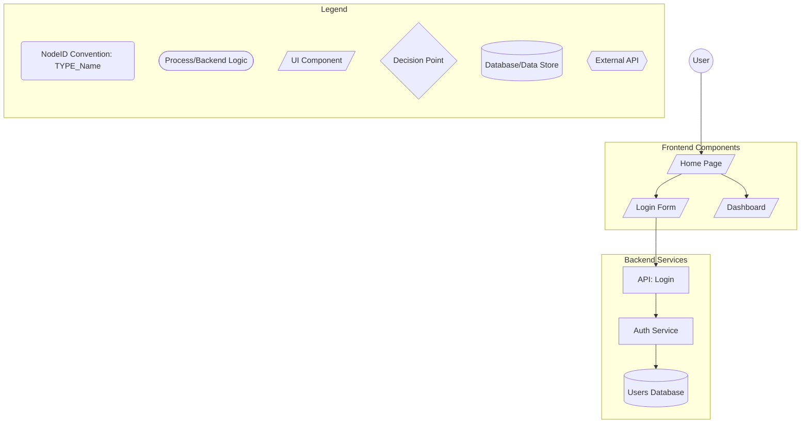

# NDv1.9: Retrofit Existing Project

## Context & Prerequisites

You are retrofitting Noderr to an existing codebase. The user has:
- ✅ **Downloaded Noderr ZIP** and extracted to project root
- ✅ **Existing codebase** with working application  
- ✅ **Noderr template files** present in `noderr/`, `noderr/specs/`, `noderr/prompts/`
- ✅ **Template `noderr/environment_context.md`** present and needs completion

## Your Mission

Perform comprehensive analysis of the existing project and **update the Noderr template files** to represent the actual codebase. The goal is complete "as-is" documentation of existing components, ready for systematic Noderr development.

**CRITICAL RULE: This is analysis and documentation ONLY. You MUST NOT modify application source code. Only update Noderr template files and create specifications.**

---

### Phase 1: Environment-Aware Codebase Analysis

#### 1.1 Complete Environment Context (MANDATORY FIRST STEP)

**CRITICAL ENVIRONMENT AWARENESS**: Before running any commands, understand:
- You are documenting the DEVELOPMENT environment you're currently working in
- This is NOT the production/deployed environment
- For existing projects, there's likely ALREADY a deployed production version
- Example: In Replit, document the workspace preview URL, NOT the .repl.app deployment
- Example: In Vercel, document localhost:3000, NOT the .vercel.app URL
- Example: In Heroku, document your local dev environment, NOT the .herokuapp.com URL

**The `environment_context.md` template exists but is unfilled. Complete it following this environment-aware process:**

1. **Read the discovery instructions** in `environment_context.md`
2. **Execute the ENVIRONMENT TYPE CHECK first**:
   ```bash
   echo "=== ENVIRONMENT TYPE CHECK ==="
   echo "Current working directory: $(pwd)"
   echo "Development environment indicators:"
   env | grep -E "REPL|CLOUD|VIRTUAL|AWS|GCP|AZURE|HEROKU|VERCEL|NETLIFY|LOVABLE"
   echo ""
   echo "⚠️ CONFIRMING: I am documenting the DEVELOPMENT workspace, not production"
   echo "=== END ENVIRONMENT CHECK ==="
   ```
3. **Execute EVERY discovery command** from the CRITICAL DISCOVERY SEQUENCE
4. **Document the development environment** - all commands, URLs, and configurations should reflect the development workspace

#### 1.2 Complete Replacement Process

**For EVERY section in the environment context file:**

1. **Run the actual commands** specified in that section
2. **Document the real output** - not examples, not placeholders
3. **Replace ALL [bracketed text]** with actual tested results
4. **Test commands work** before documenting them
5. **For Section 5.3 (Application Access)**, ensure you document:
   - `local_dev_preview`: The development preview URL (what you use for testing)
   - `public_deployed_app`: The production URL (if it exists) - marked as "DO NOT USE FOR TESTING"

**Example of what COMPLETE means:**
```bash
# WRONG (still has placeholders):
# Platform Detection Results
[Document detected platform, e.g.:]
# Returns: [actual env vars that indicate platform]

# RIGHT (completely filled):
# Platform Detection Results
env | grep -E "REPL|CLOUD|VIRTUAL"
# Returns: REPL_OWNER=username
#          REPL_ID=12345abc
#          REPLIT_DEV_DOMAIN=project.username.repl.co

# RIGHT (URL documentation for existing project):
access_urls:
  local_dev_preview: 
    url: "https://project.username.repl.co"
    description: "Primary development testing URL"
    how_to_access: "Visible in Replit preview pane"
  public_deployed_app:
    url: "https://myapp.repl.app"
    description: "Live production app - DO NOT MODIFY during development"
    warning: "⚠️ Real users are using this!"
```

#### 1.3 MANDATORY Verification Step

**Before proceeding to Phase 2:**

1. **Count remaining brackets**: 
   ```bash
   grep -c "\[.*\]" noderr/environment_context.md
   ```

2. **VERIFY count is 0**: No [bracketed placeholders] can remain

3. **Verify environment distinction**:
   ```bash
   # Check that both URLs are documented
   if grep -q "local_dev_preview" noderr/environment_context.md && grep -q "public_deployed_app" noderr/environment_context.md; then
       echo "✅ PASS: Both development and production URLs documented"
   else
       echo "❌ FAIL: Environment distinction missing - CRITICAL for existing projects"
       exit 1
   fi
   ```

4. **If count > 0 or URLs missing**: 
   - Find each remaining placeholder
   - Run the missing discovery commands
   - Fill in the actual values
   - Re-verify until count = 0

5. **Test critical commands**:
   - Package installation command
   - Test execution command
   - Development server command
   - Git operations
   - **Verify the local_dev_preview URL works**
   - **Verify the public_deployed_app URL exists (but DO NOT modify it)**

#### 1.4 Environment Context Success Criteria

**Environment context is complete when:**
- [ ] Zero [bracketed placeholders] remain in file
- [ ] All discovery commands executed and documented
- [ ] All documented commands tested and work
- [ ] **Both local_dev_preview and public_deployed_app URLs documented**
- [ ] **Clear indication which URL is for development testing**
- [ ] **Clear warning that production URL has real users**
- [ ] Platform-specific workflows documented
- [ ] Critical platform restrictions documented
- [ ] File contains real, tested values throughout
- [ ] **Environment clearly identified as DEVELOPMENT**

**CRITICAL**: Cannot proceed to Phase 2 until environment context verification passes with 0 brackets remaining AND both URLs documented.

```bash
# MANDATORY: Verify environment context is 100% complete
bracket_count=$(grep -c "\[.*\]" noderr/environment_context.md)
if [ $bracket_count -eq 0 ]; then
    echo "✅ Environment context complete: 0 placeholders remaining"
else
    echo "❌ FAILED: $bracket_count placeholders still remain"
    echo "MUST complete environment context before proceeding"
    exit 1
fi

# MANDATORY: Verify environment distinction (CRITICAL for existing projects)
if grep -q "local_dev_preview" noderr/environment_context.md && grep -q "public_deployed_app" noderr/environment_context.md; then
    echo "✅ Development vs Production URLs properly documented"
    
    # For existing projects, production URL should exist
    prod_url=$(grep -A 2 'public_deployed_app:' noderr/environment_context.md | grep 'url:' | head -1 | cut -d'"' -f2)
    if [[ "$prod_url" == *"Not deployed"* ]]; then
        echo "⚠️ WARNING: Existing project but no production URL found"
    else
        echo "✅ Production URL documented: $prod_url (DO NOT MODIFY)"
    fi
else
    echo "❌ FAILED: Must document both development and production URLs"
    echo "This is CRITICAL for existing projects to avoid production accidents"
    exit 1
fi
```

#### 1.5 Comprehensive Existing Component Analysis

**Using environment-specific tools, analyze the entire codebase for existing components:**

**Project Configuration Analysis:**
- Language, framework, dependencies, versions from `package.json`, `requirements.txt`, etc.
- Build scripts, development commands, deployment configuration
- Database configuration, external service integrations
- **Check for deployment configuration files** (e.g., `.herokuapp`, `vercel.json`, `netlify.toml`)

**Existing Component Identification - Follow Architecture Generator Conventions:**

**Study Architecture Generator NodeID Conventions First:**
- Review `NDv1.9__Architecture_Generator.md` for proper NodeID patterns
- Understand the TYPE_Name convention (e.g., `UI_HomePage`, `API_GetUser`)
- Note the standard prefixes for different component types

**Frontend Components:**
- React/Vue/Angular components → `UI_ComponentName`
- Pages and views → `UI_PageName`
- Forms and inputs → `UI_FormName`
- Navigation elements → `UI_NavElement`

**Backend Components:**
- API routes and endpoints → `API_EndpointName`
- Service classes and functions → `SVC_ServiceName`
- Middleware components → `MIDDLEWARE_Name`
- Controllers → `CTRL_ControllerName`

**Data Components:**
- Database models → `MODEL_EntityName`
- Repository classes → `DATA_RepositoryName`
- Database migrations → `MIGRATION_Name`
- Query builders → `QUERY_BuilderName`

**Utility Components:**
- Helper functions → `UTIL_HelperName`
- Configuration files → `CONFIG_SettingName`
- Validation logic → `VALID_ValidatorName`
- Constants and enums → `CONST_ConstantName`

**Infrastructure Components:**
- Authentication logic → `AUTH_ComponentName`
- Error handlers → `ERROR_HandlerName`
- Logging components → `LOG_LoggerName`
- Testing utilities → `TEST_UtilityName`

#### 1.6 Create NodeID Inventory

For every implemented component found:
- **Assign a clear NodeID** following Architecture Generator conventions
- **Use TYPE_Name pattern** (e.g., `UI_LoginForm`, `API_UserCreate`, `SVC_AuthService`)
- **Document file location** where component exists
- **Note component purpose** and basic functionality
- **Identify dependencies** and connections to other components

---

### Phase 2: Update All Core Noderr Files

#### 2.1 Update `noderr/noderr_project.md`

**The template exists - fill it with actual project details:**

1. **Replace ALL [bracketed placeholders]** with real project information
2. **Technology Stack**: Use EXACT versions from package files
3. **Key Features**: Document what actually exists, not planned features
4. **Architecture Decisions**: Document actual patterns used
5. **Coding Standards**: Identify standards actually followed in codebase
6. **Environment Focus**: Add note: "Development environment documented in environment_context.md"
7. **Deployment**: Document if/how the project is currently deployed

#### 2.2 Update `noderr/noderr_architecture.md` - Following Architecture Generator Conventions

**CRITICAL: Must follow Architecture Generator conventions for the diagram**

**STEP 1: Reference Architecture Generator Principles**
- Consult `NDv1.9__Architecture_Generator.md` for exact conventions
- Review the Legend requirements
- Understand NodeID naming patterns
- Note the required shapes for different component types

**STEP 2: Create Architecture Diagram Following ALL Conventions**

**Replace template Mermaid diagram with actual architecture that MUST include:**

1. **MANDATORY Legend Subgraph** - Copy this structure exactly:
   ```mermaid
   subgraph Legend
       direction TB
       L_IDConv(NodeID Convention: TYPE_Name)
       L_Proc([Process/Backend Logic])
       L_UI[/UI Component/]
       L_Decision{Decision Point}
       L_DB[(Database/Data Store)]
       L_ExtAPI{{External API}}
   end
   ```

2. **Proper NodeID Convention** - ALL components must use TYPE_Name pattern:
   - ✅ CORRECT: `UI_HomePage`, `API_GetUser`, `SVC_AuthService`
   - ❌ WRONG: "HomePage", "GET /user", "auth-service"

3. **Consistent Component Shapes**:
   - UI Components: `UI_Name[/Label/]`
   - Backend/Process: `API_Name[Label]` or `SVC_Name[Label]`
   - Database: `DB_Name[(Label)]`
   - External APIs: `EXT_Name{{Label}}`

4. **Complete Architecture Content**:
   - All discovered existing components with proper NodeIDs
   - Actual data flows and dependencies based on code analysis
   - Logical groupings using subgraphs (Frontend, Backend, Data, etc.)
   - Real connections based on actual implementation

**Example Structure:**


#### 2.3 Create Initial Tracker from Architecture

**Populate `noderr/noderr_tracker.md` with every NodeID:**

1. **Extract all NodeIDs** from completed architecture diagram
2. **Verify NodeIDs follow conventions** before adding to tracker
3. **Create tracker row** for each NodeID with:
   - Realistic status based on code quality assessment
   - Dependencies based on actual code relationships
   - Logical grouping by functional area
   - Links to specs that will be created

---

### Phase 3: Verify Architecture Completeness

#### 3.1 Mathematical Verification Step

**Before proceeding to Phase 4:**

```bash
# Extract all NodeIDs from the completed architecture
total_nodeids=$(grep -o "[A-Z][A-Z_]*[A-Z]" noderr/noderr_architecture.md | sort -u | wc -l)
echo "Total NodeIDs to process: $total_nodeids"

# Verify architecture has content
if [ $total_nodeids -eq 0 ]; then
    echo "❌ FAILED: No NodeIDs found in architecture"
    echo "MUST create complete architecture before proceeding"
    exit 1
else
    echo "✅ Architecture contains $total_nodeids NodeIDs"
fi
```

#### 3.2 Architecture Quality Check

**Verify Architecture Generator Conventions:**
```bash
# Check for Legend presence (MANDATORY)
if grep -q "subgraph Legend" noderr/noderr_architecture.md; then
    echo "✅ PASS: Legend subgraph found"
else
    echo "❌ FAIL: Missing required Legend subgraph"
    echo "Architecture Generator REQUIRES a Legend section"
    exit 1
fi

# Check NodeID format compliance
nodeids=$(grep -oE '\b[A-Z][A-Z_]*[A-Za-z]+\b' noderr/noderr_architecture.md | grep -v "^L_" | sort -u)
invalid_count=0
for nodeid in $nodeids; do
    if ! echo "$nodeid" | grep -qE "^[A-Z]+_[A-Za-z]+"; then
        echo "❌ Invalid NodeID format: $nodeid"
        ((invalid_count++))
    fi
done

if [ $invalid_count -eq 0 ]; then
    echo "✅ PASS: All NodeIDs follow TYPE_Name convention"
else
    echo "❌ FAIL: $invalid_count NodeIDs don't follow convention"
    exit 1
fi
```

**Verify Architecture Diagram:**
- [ ] **Legend Present** - Contains valid Legend subgraph
- [ ] **NodeID Convention** - ALL components use TYPE_Name pattern
- [ ] **NOT using plain labels** - No "Home Page" or "user service"
- [ ] Contains valid Mermaid syntax that renders properly
- [ ] Shows logical component groupings using subgraphs
- [ ] NodeID naming follows conventions (TYPE_Name format) consistently
- [ ] Connections represent actual code dependencies
- [ ] No orphaned or disconnected components
- [ ] All major existing components are represented

**Verify Component Categories:**
- [ ] **UI Components**: All major frontend components documented with UI_ prefix
- [ ] **API Endpoints**: All routes and endpoints documented with API_ prefix
- [ ] **Services**: All business logic services documented with SVC_ prefix
- [ ] **Data Components**: All models, repositories documented with appropriate prefixes
- [ ] **Utilities**: All helper functions documented with UTIL_/CONFIG_ prefixes
- [ ] **Infrastructure**: All auth, config, logging documented with appropriate prefixes

---

### Phase 4: Create Specifications for All Existing Components

**CRITICAL REQUIREMENT**: Create exactly ONE spec file for every NodeID in the architecture.

#### 4.1 Generate Complete NodeID List

```bash
# Extract all NodeIDs from the completed architecture
nodeid_list=$(grep -o "[A-Z][A-Z_]*[A-Z]" noderr/noderr_architecture.md | sort -u)
total_nodeids=$(echo "$nodeid_list" | wc -l)
echo "Total NodeIDs to process: $total_nodeids"
echo "NodeIDs found:"
echo "$nodeid_list"
```

#### 4.2 Create Specifications for All Components

**For each NodeID in the architecture, create a complete specification:**

```markdown
# [NodeID].md

## Purpose
[What this component actually does based on code analysis]

## Current Implementation Status
✅ **IMPLEMENTED** - Component exists and is functional in the codebase

## Implementation Analysis
- **Location**: [Actual file paths where this component exists]
- **Current interfaces**: [APIs, methods, props, functions exposed]
- **Dependencies**: [What this component actually requires/imports]
- **Dependents**: [What actually depends on this component]

## Core Logic & Functionality
[Document what the code actually does, step by step]

## Current Quality Assessment
- **Completeness**: [How complete the implementation is]
- **Code Quality**: [Assessment of current code quality]
- **Test Coverage**: [Current testing status]
- **Documentation**: [Current documentation status]

## Technical Debt & Improvement Areas
- [List current issues, shortcuts, missing features]
- [Performance concerns if any]
- [Security considerations if any]
- [Maintainability issues if any]

## Interface Definition
```[language]
// Actual interface/API as currently implemented
```

## ARC Verification Criteria

### Functional Criteria
- [ ] [Verify current functionality works as intended]
- [ ] [Test actual business logic implementation]

### Input Validation Criteria  
- [ ] [Verify current input validation approach]
- [ ] [Test edge cases with current implementation]

### Error Handling Criteria
- [ ] [Verify current error handling patterns]
- [ ] [Test failure scenarios with current code]

### Quality Criteria
- [ ] [Performance assessment of current implementation]
- [ ] [Security review of current code]
- [ ] [Maintainability assessment]

## Implementation Priority
**[VERIFIED/TODO/ISSUE]** - [Based on actual code quality assessment]

## Future Enhancement Opportunities
- [Specific improvements that could be made]
- [Features that could be added]
- [Refactoring opportunities]

## Files & Implementation Details
- `[filename]` - Lines [X-Y]: [Current implementation details]
- `[filename]` - Lines [X-Y]: [Related functionality]
```

#### 4.3 Mandatory Verification Step

**Before proceeding to Phase 5:**
1. Count total NodeIDs in architecture: `[X]`
2. Count spec files created: `[Y]` 
3. **VERIFY**: X = Y (every NodeID has a spec)
4. **If counts don't match**: Find missing specs and create them

```bash
# Count NodeIDs in architecture
nodeid_count=$(grep -o "[A-Z][A-Z_]*[A-Z]" noderr/noderr_architecture.md | sort -u | wc -l)

# Count spec files
spec_count=$(ls specs/*.md 2>/dev/null | wc -l)

echo "NodeIDs in architecture: $nodeid_count"
echo "Spec files created: $spec_count"

# REQUIREMENT: Must match exactly
if [ $nodeid_count -eq $spec_count ]; then
    echo "✅ PASS: Every NodeID has a spec ($nodeid_count = $spec_count)"
else
    echo "❌ FAIL: Mismatch - $nodeid_count NodeIDs but $spec_count specs"
    echo "MUST create missing specs before proceeding"
    exit 1
fi
```

**Success criteria**: `specs/` directory contains exactly one `.md` file for every NodeID in the architecture diagram.

---

### Phase 5: Populate Tracker & Calculate Progress

#### 5.1 Update Tracker with Realistic Statuses

**For each NodeID, assign realistic status based on actual code quality:**

- `🟢 [VERIFIED]` - Complete, robust, well-implemented components
- `⚪ [TODO]` - Functional but needs work or improvement  
- `❗ [ISSUE]` - Broken or incomplete components

#### 5.2 Verify Tracker-Architecture Alignment

**Verify Tracker Consistency:**
- [ ] Every NodeID from architecture is in tracker
- [ ] Every spec file has corresponding tracker entry
- [ ] All spec links in tracker point to existing files
- [ ] Dependencies listed make architectural sense
- [ ] Progress percentage calculated correctly

#### 5.3 Schedule Technical Debt (Optional)

**For components with significant technical debt, optionally create REFACTOR tasks:**

- Components with major maintainability issues
- Components with security concerns
- Components with performance problems
- Components with poor test coverage

#### 5.4 Calculate Initial Progress

```bash
# Count statuses
verified_count=$(grep -c "🟢 \[VERIFIED\]" noderr/noderr_tracker.md)
todo_count=$(grep -c "⚪ \[TODO\]" noderr/noderr_tracker.md)
issue_count=$(grep -c "❗ \[ISSUE\]" noderr/noderr_tracker.md)
total_count=$((verified_count + todo_count + issue_count))

# Calculate progress percentage
if [ $total_count -eq 0 ]; then
    progress_percent=0
else
    progress_percent=$((verified_count * 100 / total_count))
fi

# Update progress line in tracker
sed -i "s/Progress: [0-9]*%/Progress: $progress_percent%/" noderr/noderr_tracker.md

echo "System Health Analysis:"
echo "✅ VERIFIED: $verified_count ($progress_percent%)"
echo "⚪ TODO: $todo_count"
echo "❗ ISSUES: $issue_count"
echo "📊 TOTAL: $total_count components"
```

---

### Phase 6: Environment Commands Verification

#### 6.1 Test Critical Commands Actually Work

```bash
# Test package installation command from environment_context.md
[Extract and test the documented package install command]

# Test development server command
[Extract and test the documented dev server command]

# Test development URL works
dev_url=$(grep -A 2 'local_dev_preview:' noderr/environment_context.md | grep 'url:' | head -1 | cut -d'"' -f2)
echo "Testing development URL: $dev_url"
curl -s -o /dev/null -w "Dev server status: %{http_code}\n" "$dev_url"

# Verify production URL exists (but DO NOT test/modify)
prod_url=$(grep -A 2 'public_deployed_app:' noderr/environment_context.md | grep 'url:' | head -1 | cut -d'"' -f2)
echo "Production URL documented: $prod_url (DO NOT MODIFY - has real users)"

# Test git operations
git status
git log --oneline -3

# Test build command (if applicable)
[Extract and test the documented build command]
```

**Document Results:**
- ✅ All commands work as documented
- ✅ Development URL accessible for testing
- ✅ Production URL documented with warnings
- ⚠️ Some commands need adjustment 
- ❌ Commands fail - environment context incomplete

---

### Phase 7: Log & Final Commit

#### 7.1 Log Retrofit Operation

**Prepend comprehensive entry to `noderr/noderr_log.md`:**

```markdown
---
**Type:** RetrofitCompletion
**Timestamp:** [Generated Timestamp]
**NodeID(s):** Project-Wide
**Logged By:** AI-Agent
**Details:**
Successfully retrofitted Noderr v1.9 framework onto existing project.
- **Environment Context**: 100% completed (0 [brackets] remaining)
- **Environment Distinction**: CLEAR - Dev: [dev_url], Prod: [prod_url]
- **Production Warning**: Documented that production has real users
- **Architecture Conventions**: Followed Architecture Generator patterns (Legend, NodeIDs)
- **Existing Components Documented**: [X] NodeIDs identified and spec'd
- **Specification Coverage**: 100% - Every existing component has complete spec
- **Initial Status**: [Y] Verified, [Z] TODO, [A] Issues. Progress: [X]%
- **System Ready**: Complete visibility into existing codebase achieved
- **Development Strategy**: Use [local_dev_preview] for ALL testing
---
```

#### 7.2 Final Commit

**Commit all Noderr files to version control:**

```bash
# Stage all Noderr framework files
git add noderr/ specs/ planning/ prompts/ environment_context.md

# Create comprehensive commit
git commit -m "feat: Complete Noderr v1.9 retrofit with existing component documentation

- Environment context 100% configured and tested
- Development vs Production URLs clearly distinguished
- Architecture follows Generator conventions with proper NodeIDs
- Architecture documented with $total_nodeids existing components
- Complete spec coverage: $spec_count specifications created
- Initial system health: $progress_percent% verified components
- Development environment: $dev_url (for testing)
- Production environment: $prod_url (DO NOT MODIFY - has real users)
- Ready for systematic Noderr development methodology"
```

---

### Phase 8: Final System Verification & Completion

#### 8.1 Environment Context Double-Check

```bash
# MANDATORY: Verify environment context is 100% complete
bracket_count=$(grep -c "\[.*\]" noderr/environment_context.md)
if [ $bracket_count -eq 0 ]; then
    echo "✅ Environment context complete: 0 placeholders remaining"
else
    echo "❌ FAILED: $bracket_count placeholders still remain in noderr/environment_context.md"
    echo "MUST fix all placeholders before proceeding"
    exit 1
fi

# MANDATORY: Verify environment distinction (CRITICAL for existing projects)
if grep -q "local_dev_preview" noderr/environment_context.md && grep -q "public_deployed_app" noderr/environment_context.md; then
    echo "✅ Development vs Production properly distinguished"
    
    dev_url=$(grep -A 2 'local_dev_preview:' noderr/environment_context.md | grep 'url:' | head -1 | cut -d'"' -f2)
    prod_url=$(grep -A 2 'public_deployed_app:' noderr/environment_context.md | grep 'url:' | head -1 | cut -d'"' -f2)
    
    echo "Development URL: $dev_url (for testing)"
    echo "Production URL: $prod_url (DO NOT MODIFY - has real users)"
    
    # Check for proper warnings
    if grep -q "DO NOT.*test\|real users\|DO NOT MODIFY" noderr/environment_context.md; then
        echo "✅ Production warnings properly documented"
    else
        echo "⚠️ WARNING: Missing clear production warnings"
    fi
else
    echo "❌ FAILED: Must document both development and production URLs"
    echo "This is CRITICAL for existing projects to prevent production accidents"
    exit 1
fi
```

#### 8.2 Architecture Conventions Double-Check

```bash
# Verify Architecture follows Generator conventions
if ! grep -q "subgraph Legend" noderr/noderr_architecture.md; then
    echo "❌ FAILED: Architecture missing required Legend"
    exit 1
fi

# Verify NodeID conventions
invalid_nodeids=$(grep -oE '\b[A-Z][A-Z_]*[A-Za-z]+\b' noderr/noderr_architecture.md | grep -v "^L_" | grep -vE "^[A-Z]+_[A-Za-z]+")
if [ -n "$invalid_nodeids" ]; then
    echo "❌ FAILED: Found NodeIDs not following TYPE_Name convention:"
    echo "$invalid_nodeids"
    exit 1
fi

echo "✅ Architecture follows all Generator conventions"
```

#### 8.3 Update Tracker with Accurate Statuses

- Review each component after spec creation
- Set realistic statuses based on actual code quality findings
- Update progress percentage to reflect true system state

#### 8.4 Verify Complete Retrofit

- **No [bracketed placeholders]** remain in ANY Noderr files
- **All NodeIDs** follow TYPE_Name convention
- **Architecture includes Legend** subgraph  
- **All technology versions** are actual, not "latest"
- **Environment context** has real, tested commands with 0 brackets
- **Development vs Production URLs** clearly distinguished
- **Production warnings** documented for existing project
- **Every NodeID** has a complete specification
- **Tracker count** matches architecture NodeID count exactly

#### 8.5 Final Verification Checklist

- [ ] **Environment context**: 0 [brackets] remaining, all commands tested and working
- [ ] **Environment distinction**: Both dev and prod URLs documented with clear usage
- [ ] **Production warnings**: Clear indication that prod has real users
- [ ] **Architecture documented**: Complete Mermaid diagram with all existing NodeIDs
- [ ] **Architecture conventions**: Legend present, NodeIDs follow TYPE_Name pattern
- [ ] **Specification coverage**: Every NodeID has a complete spec (exact count match)
- [ ] **Mathematical verification**: NodeIDs in architecture = Specs created (exact match)
- [ ] **Tracker populated**: Every NodeID with realistic status and dependencies
- [ ] **Progress calculated**: Accurate percentage based on actual component quality
- [ ] **No placeholders remain**: All template files completely filled
- [ ] **Commands verified**: All documented commands tested and working
- [ ] **Comprehensive logging**: Complete retrofit process documented
- [ ] **Version control**: All Noderr files committed with descriptive message

---

### Phase 9: Final Report

**Provide comprehensive retrofit summary:**

```markdown
# Retrofit Complete! 🎉

## 📊 Existing System Documentation Results
- **Environment Context**: ✅ 100% complete (0 [brackets] remaining)
- **Environment Distinction**: ✅ CLEAR separation of dev vs prod
- **Development URL**: [local_dev_preview] - for ALL testing
- **Production URL**: [public_deployed_app] - DO NOT MODIFY (has real users)
- **Architecture Conventions**: ✅ Follows Generator patterns (Legend, NodeIDs)
- **Existing Components Documented**: [X] NodeIDs identified and spec'd
- **Specification Coverage**: 100% - Every existing component has complete spec
- **Initial System Health**: [Y]% ([A] verified, [B] todo, [C] issues)

## 🔍 Architecture Analysis Summary
- **Primary Pattern**: [Architectural style discovered]
- **Technology Stack**: [Languages/frameworks with actual versions]
- **NodeID Convention**: TYPE_Name pattern applied consistently
- **Component Categories**: 
  - UI Components: [X] (all with UI_ prefix)
  - API Endpoints: [Y] (all with API_ prefix)
  - Services: [Z] (all with SVC_ prefix)
  - Data Access: [A] (with appropriate prefixes)
  - Utilities: [B] (with UTIL_/CONFIG_ prefixes)
  - Infrastructure: [C] (with appropriate prefixes)

## 🎯 Immediate Development Readiness
- **Environment**: ✅ Fully configured and tested for DEVELOPMENT
- **Testing Strategy**: ✅ Use [local_dev_preview] for ALL testing
- **Production Safety**: ✅ [public_deployed_app] documented with warnings
- **Architecture**: ✅ Complete visibility with proper conventions
- **Specifications**: ✅ Every existing component documented with quality assessment
- **Quality Assessment**: ✅ Realistic status assigned to all components

## 🔧 Environment Ready
- **Platform**: [Detected platform and configuration]
- **Stack**: [Technology stack with versions]
- **Development Commands**: All tested and working
- **Critical Tools**: [List verified tools]
- **Dev Server**: Run with [command] and test at [local_dev_preview]
- **⚠️ Production**: [public_deployed_app] - NEVER test here

## 📋 Technical Debt Summary
- **High Priority**: [X] components needing immediate attention
- **Medium Priority**: [Y] components needing improvement
- **Low Priority**: [Z] components with minor issues

## 🚨 Critical Reminders for Existing Projects
1. **ALWAYS test at**: [local_dev_preview]
2. **NEVER modify**: [public_deployed_app] - has real users!
3. **Before deploying**: Test thoroughly in development first
4. **Production access**: Use deployment commands, not direct modification

## 🚀 Next Steps
The project retrofit is complete and ready for verification.

**Next Command**: Use `NDv1.9__Onboarding_Audit_Verification.md` to verify retrofit completeness and identify highest priority development tasks.

**After Audit Passes**: Use `NDv1.9__Start_Work_Session.md` to begin systematic development.

**Development Focus**: [X] VERIFIED components ready for enhancement, [Y] TODO components need improvement, [Z] ISSUE components require immediate attention.

**Remember**: This is an existing project with real users. Always develop and test using [local_dev_preview], never directly on [public_deployed_app].
```

---

## SUCCESS CRITERIA

Retrofit is complete and successful when:
- [ ] **Environment context**: 0 [brackets] remaining, all commands tested and working
- [ ] **Environment distinction**: Both dev and prod URLs clearly documented
- [ ] **Production warnings**: Clear indication that prod has real users
- [ ] **Architecture documented**: Complete Mermaid diagram with all existing NodeIDs
- [ ] **Architecture conventions**: Legend present, all NodeIDs follow TYPE_Name pattern
- [ ] **Specification coverage**: Every NodeID has a complete spec (exact count match)
- [ ] **Mathematical verification**: NodeIDs in architecture = Specs created (exact match)
- [ ] **Tracker populated**: Every NodeID with realistic status and dependencies
- [ ] **Progress calculated**: Accurate percentage based on actual component quality
- [ ] **No placeholders remain**: All template files completely filled
- [ ] **Commands verified**: All documented commands tested and working
- [ ] **Development URL tested**: Confirmed accessible for development
- [ ] **Production URL documented**: With clear DO NOT MODIFY warnings
- [ ] **Comprehensive logging**: Complete retrofit process documented
- [ ] **Version control**: All Noderr files committed with descriptive message

**CRITICAL REQUIREMENTS:**
- **Environment Context MUST be 100% complete** - verified with `grep -c "\[.*\]" environment_context.md` returning 0
- **Environment Distinction MUST be clear** - both dev and prod URLs documented with usage instructions
- **Architecture MUST follow Generator conventions** - Legend, NodeIDs, shapes must follow Generator patterns
- **Specs MUST equal NodeIDs** - if architecture has 35 NodeIDs, must have exactly 35 spec files
- **All commands MUST be tested** - no guessing, no examples, only verified working commands
- **Production warnings MUST be present** - existing projects have real users in production

## CRITICAL NOTES

1. **Document Existing Reality** - Focus on components that actually exist in codebase
2. **Complete Environment First** - Cannot proceed without 100% complete environment context
3. **Distinguish Dev vs Prod** - CRITICAL for existing projects to prevent production accidents
4. **Follow Architecture Conventions** - Legend, NodeIDs, shapes must follow Generator patterns
5. **Mathematical Verification** - Prove complete coverage with objective counts
6. **Honest Assessment** - Document actual code quality, not idealized version
7. **No Complex Pattern Analysis** - Document what exists, not what could be abstracted
8. **Realistic Statuses** - Assign VERIFIED/TODO/ISSUE based on actual code quality
9. **Practical Focus** - Goal is immediate development readiness, not architectural perfection
10. **Zero Tolerance for Placeholders** - All [brackets] must be eliminated with real values
11. **Command Verification** - Every documented command must be tested and working
12. **Complete Coverage** - Every existing component must have a specification
13. **Production Safety** - Existing projects have real users - must prevent accidental production changes

The goal is complete, honest documentation of existing system components with full Noderr framework integration, following Architecture Generator conventions, with clear development/production distinction, ready for systematic improvement through disciplined development methodology while protecting the live production environment.
