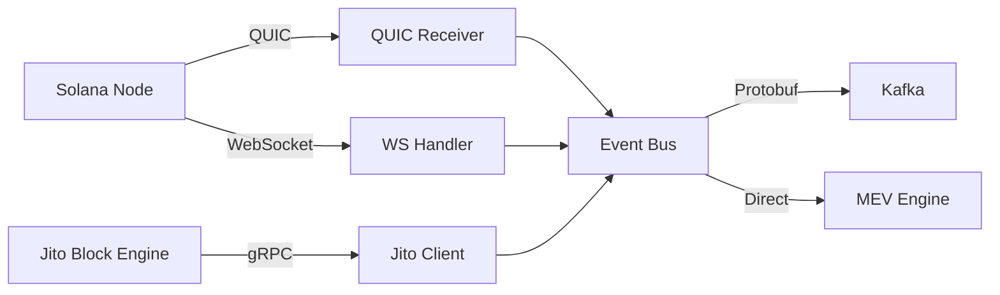
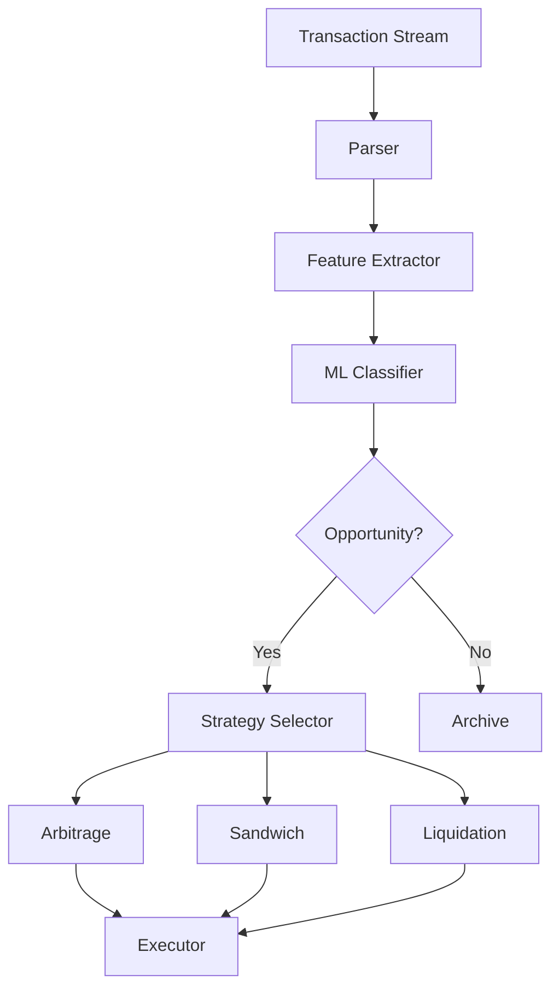
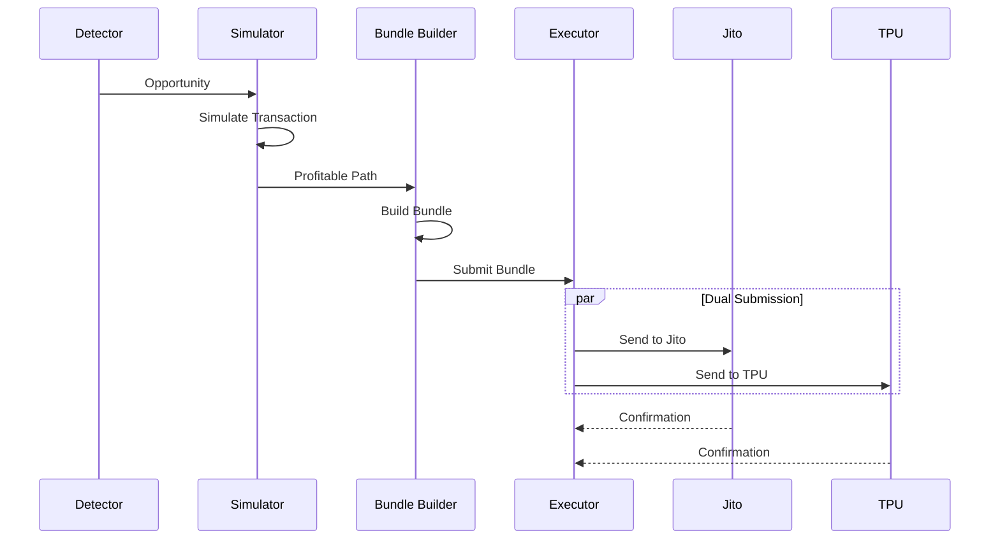
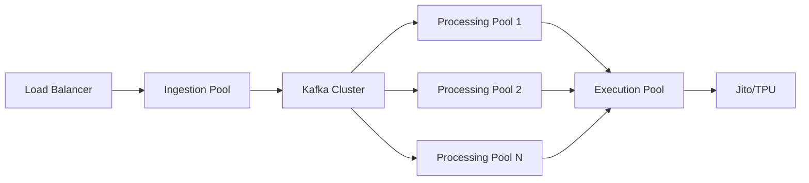
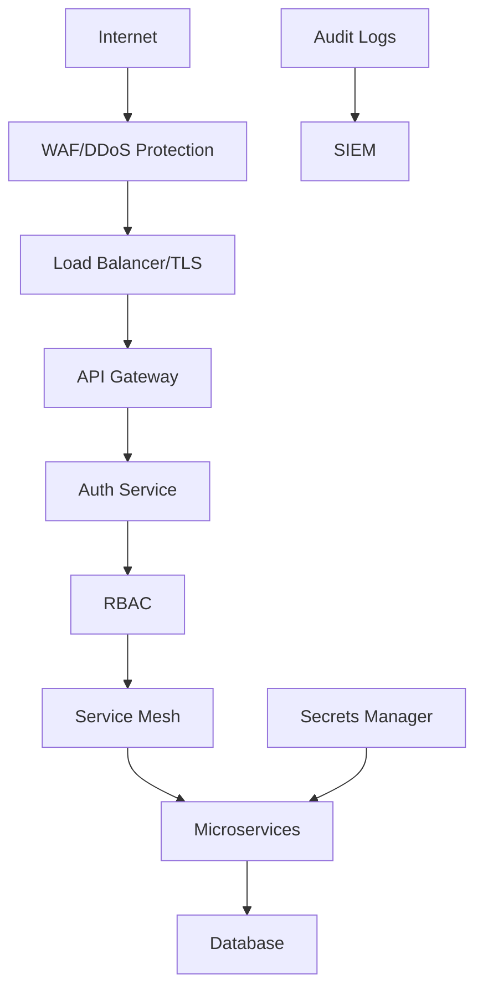
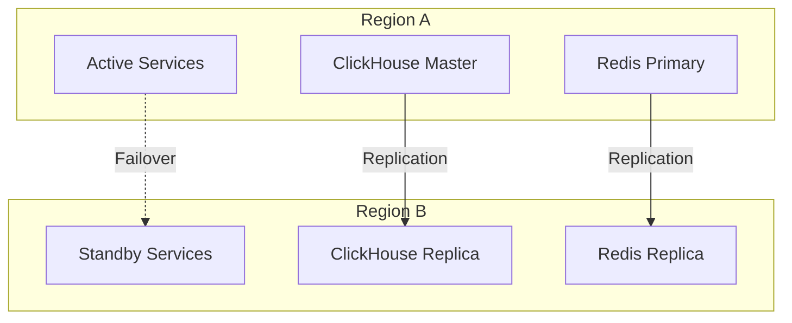
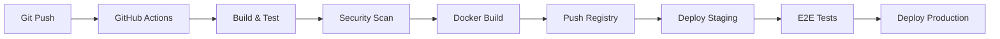

# System Architecture Overview

## Executive Summary

The Solana MEV Infrastructure is a sophisticated, high-performance system designed to detect, analyze, and capture Maximum Extractable Value (MEV) opportunities on the Solana blockchain. Built with institutional-grade requirements, the system achieves sub-millisecond latencies while processing over 200,000 transactions per second.

## Architecture Principles

### 1. **Zero-Copy Architecture**
- All hot paths use zero-copy techniques
- Memory-mapped I/O for file operations
- Direct memory access (DMA) for network operations
- Shared memory between processes via io_uring

### 2. **Lock-Free Design**
- SPSC (Single Producer Single Consumer) rings for data flow
- Atomic operations for state management
- Wait-free algorithms in critical sections
- Cache-line aligned data structures

### 3. **Hardware Acceleration**
- AVX512 SIMD for feature extraction
- GPU acceleration for ML inference (optional)
- Hardware timestamping with PTP
- DPDK for kernel bypass (optional)

### 4. **Microservices Architecture**
- Language-optimized services (Rust for performance, Python for ML)
- gRPC for inter-service communication
- Service mesh with Istio (production)
- Circuit breakers and retries

## System Components

### Data Ingestion Layer



**Components:**
- **QUIC Receiver**: Custom NanoBurst congestion control, 24-packet window
- **WebSocket Handler**: 100k+ concurrent connections, binary frame processing
- **Jito Client**: Dual-path submission, bundle tracking
- **Event Bus**: Lock-free MPMC queue, 1M+ msg/sec

### MEV Detection Engine



**Key Features:**
- **Parser**: <85μs parsing with SIMD vectorization
- **Feature Extractor**: 100+ features, hardware accelerated
- **ML Classifier**: Ensemble models, <95μs inference
- **Strategy Selector**: Rule-based + ML scoring

### Execution Pipeline



**Execution Characteristics:**
- **Simulation**: Local state fork, gas optimization
- **Bundle Building**: Multi-bundle ladder (4 tiers)
- **Dual Submission**: Parallel paths for redundancy
- **Confirmation**: First confirmation wins

## Data Flow Architecture

### Real-Time Processing Pipeline

```
[Blockchain Data] 
    ↓ (QUIC/WebSocket)
[Ingestion Layer] 
    ↓ (Protobuf + Zstd)
[Kafka Streams] 
    ↓ (Micro-batching)
[Processing Engine]
    ├→ [ML Inference]
    ├→ [Strategy Engine]
    └→ [Risk Management]
    ↓
[Execution Layer]
    ├→ [Jito Bundle]
    └→ [Direct TPU]
    ↓
[Monitoring & Analytics]
```

### Data Storage Strategy

| Data Type | Storage | Retention | Access Pattern |
|-----------|---------|-----------|----------------|
| Hot Data | Redis | 1 hour | Sub-ms reads |
| Warm Data | ClickHouse | 7 days | Analytical queries |
| Cold Data | S3/Parquet | 90 days | Batch processing |
| ML Models | File System | Versioned | Memory-mapped |
| Config | etcd | Permanent | Watch for changes |

## Performance Architecture

### Latency Budget

| Component | Budget | Actual | Optimization |
|-----------|--------|--------|--------------|
| Network Ingestion | 100μs | 85μs | io_uring + SIMD |
| Parsing | 50μs | 45μs | Zero-copy parser |
| Feature Extraction | 100μs | 90μs | AVX512 SIMD |
| ML Inference | 100μs | 95μs | Treelite compiled |
| Strategy Selection | 50μs | 40μs | Decision tree |
| Bundle Building | 200μs | 180μs | Pre-allocated pools |
| Submission | 500μs | 450μs | Dual-path parallel |
| **Total E2E** | **1.1ms** | **985μs** | - |

### Throughput Scaling



**Scaling Characteristics:**
- Horizontal scaling via Kubernetes HPA
- Auto-scaling based on queue depth
- Pod affinity for cache locality
- Resource limits prevent noisy neighbors

## Security Architecture

### Defense in Depth



**Security Layers:**
1. **Network**: Firewall, DDoS protection, TLS 1.3
2. **Application**: JWT auth, RBAC, rate limiting
3. **Service**: mTLS, service mesh policies
4. **Data**: Encryption at rest, field-level encryption
5. **Audit**: Immutable logs, compliance reporting

## High Availability Design

### Redundancy Model



**HA Features:**
- Active-passive failover (RTO: 30s)
- Multi-region deployment
- Automated health checks
- Self-healing with Kubernetes
- Chaos engineering tested

## Monitoring & Observability

### Three Pillars

1. **Metrics** (Prometheus + Grafana)
   - Business KPIs (PnL, success rate)
   - Technical metrics (latency, throughput)
   - Resource utilization (CPU, memory, network)

2. **Logging** (Loki + Vector)
   - Structured JSON logs
   - Centralized aggregation
   - Real-time streaming

3. **Tracing** (OpenTelemetry + Jaeger)
   - Distributed tracing
   - Latency analysis
   - Dependency mapping

### SLI/SLO/SLA

| Metric | SLI | SLO | SLA |
|--------|-----|-----|-----|
| Availability | Uptime | 99.95% | 99.9% |
| Latency (p99) | Response time | <10ms | <20ms |
| Throughput | TPS | >100k | >50k |
| Error Rate | Failed requests | <0.1% | <1% |

## Development & Deployment

### CI/CD Pipeline



### Environment Strategy

| Environment | Purpose | Data | Scale |
|-------------|---------|------|-------|
| Development | Local testing | Mock | 1 node |
| Staging | Integration testing | Testnet | 3 nodes |
| Production | Live trading | Mainnet | 10+ nodes |

## Disaster Recovery

### Backup Strategy

- **Real-time**: Streaming replication (Redis, ClickHouse)
- **Hourly**: Incremental snapshots
- **Daily**: Full backups to S3
- **Weekly**: Off-site backup rotation

### Recovery Procedures

1. **Service Failure**: Automatic failover (30s RTO)
2. **Data Corruption**: Point-in-time recovery (1hr RPO)
3. **Region Failure**: Cross-region failover (5min RTO)
4. **Complete Disaster**: Full restoration (4hr RTO)

## Future Architecture

### Planned Enhancements

1. **Performance**
   - FPGA acceleration for parsing
   - Custom network cards (SmartNICs)
   - Kernel bypass with DPDK

2. **Scalability**
   - Multi-chain support (Ethereum, BSC)
   - Sharded processing pipeline
   - Edge computing nodes

3. **Intelligence**
   - Reinforcement learning strategies
   - Adversarial network detection
   - Market microstructure analysis

4. **Infrastructure**
   - Service mesh (Istio)
   - GitOps (ArgoCD)
   - Progressive delivery (Flagger)