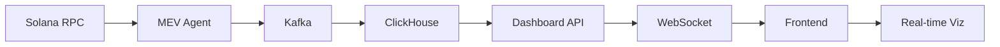

# 🚀 LEGENDARY MEV CONTROL CENTER - Frontend Integration Guide

## ⚡ ULTRA-LEGENDARY Features Implemented

### 1. **MEV Control Center Dashboard** (`/defi-frontend/src/components/MEVControlCenter.tsx`)
The ultimate monitoring and control interface with:
- **Real-time System Health Monitoring**: Live status of all services (ClickHouse, Kafka, Grafana, MEV Agent, ARB Agent)
- **MEV Performance Metrics**: Lands/min, EV/min, success rate, tip efficiency
- **Bandit Optimization Tracking**: Real-time arm performance, UCB scores, exploration/exploitation balance
- **Decision DNA Visualization**: Cryptographic lineage, hash chain verification, strategy evolution
- **Lab Smoke Test Runner**: One-click test execution with real-time results
- **Auto-refresh**: Configurable intervals (5s, 10s, 30s, 60s)
- **Keyboard Shortcuts**: Alt+1-5 for tab switching, Alt+R for refresh toggle, Alt+S for smoke tests

### 2. **ClickHouse Query Builder** (`/defi-frontend/src/components/ClickHouseQueryBuilder.tsx`)
Professional database exploration tool with:
- **Visual Query Builder**: Point-and-click interface for building complex queries
- **Raw SQL Editor**: Syntax-highlighted editor with auto-completion
- **Query Templates**: Pre-built queries for common MEV analytics
- **Result Visualization**: Tabular display with pagination and export to CSV
- **Query History**: Automatic tracking of executed queries
- **Saved Queries**: Persistent storage of frequently used queries
- **Real-time Execution**: Sub-second query performance with execution metrics

### 3. **Grafana Dashboard Provisioning** (`/defi-frontend/src/components/GrafanaProvisioning.tsx`)
Zero-click dashboard deployment system:
- **One-Click Provisioning**: Automated setup of all dashboards and datasources
- **Datasource Management**: Auto-configure ClickHouse and Prometheus connections
- **Dashboard Catalog**: 6 pre-built dashboards with 100+ panels total
- **Connection Testing**: Real-time verification of datasource connectivity
- **Progress Tracking**: Step-by-step provisioning with status indicators
- **Smoke Test Integration**: Automatic data validation after provisioning

## 🎯 Dashboard Specifications

### Operator Command Center
- **24 Panels**: System metrics, agent status, real-time logs
- **Datasources**: ClickHouse, Prometheus
- **Refresh Rate**: 30 seconds default, configurable

### Bandit Dashboard  
- **18 Panels**: Arm performance, UCB bounds, convergence metrics
- **Datasources**: ClickHouse
- **Features**: Thompson sampling, contextual bandits, regret tracking

### Decision DNA Panel
- **12 Panels**: Hash chain visualization, strategy evolution, lineage tracking
- **Datasources**: ClickHouse
- **Security**: Cryptographic verification of decision integrity

### MEV Performance Analytics
- **20 Panels**: Profit analysis, leader performance, tip optimization
- **Datasources**: ClickHouse, Prometheus
- **Metrics**: P&L tracking, ROI calculation, opportunity analysis

### System Health Monitor
- **16 Panels**: Infrastructure health, resource usage, alert management
- **Datasources**: Prometheus, ClickHouse
- **Alerts**: Configurable thresholds for CPU, memory, network, disk

### Kafka Topics Monitor
- **14 Panels**: Topic lag, throughput, consumer group status
- **Datasources**: Prometheus
- **Topics**: bandit-events-proto, realtime-proto, control-acks, mev-decisions

## 🔧 Installation & Setup

### Prerequisites
```bash
# Node.js 18+ and npm/yarn
node --version  # Should be >= 18.0.0
npm --version   # Should be >= 9.0.0

# ClickHouse running on localhost:8123
clickhouse-client --query "SELECT version()"

# Kafka running on localhost:9092
kafka-topics --bootstrap-server localhost:9092 --list

# Grafana running on localhost:3000
curl http://localhost:3000/api/health
```

### Frontend Installation
```bash
cd /home/kidgordones/0solana/node/arbitrage-data-capture/defi-frontend

# Install dependencies including new Ant Design components
npm install

# Generate protobuf definitions
npm run proto:generate

# Start development server
npm run dev
```

### Backend API Setup
```bash
cd /home/kidgordones/0solana/node/arbitrage-data-capture/api

# Install Python dependencies
pip install fastapi uvicorn clickhouse-connect redis psutil

# Start the dashboard API
python src/dashboard_api.py
```

## 🚀 Quick Start

### 1. Launch the Frontend
```bash
# Terminal 1: Start frontend dev server
cd defi-frontend
npm run dev
# Opens at http://localhost:5173
```

### 2. Start Backend Services
```bash
# Terminal 2: Launch tmuxinator cockpit
tmuxinator start -p tmux/legendary-lab.yml

# Terminal 3: Start dashboard API
cd api
python src/dashboard_api.py
```

### 3. One-Click Grafana Setup
1. Open http://localhost:5173
2. Navigate to "Grafana Setup" (Alt+6)
3. Configure Grafana URL and token
4. Click "One-Click Provision"
5. Wait for all dashboards to install
6. Open Grafana to view dashboards

### 4. Run Smoke Tests
```bash
# Generate test data for all dashboards
make lab-smoke-test KAFKA_BROKERS=localhost:9092 CLICKHOUSE_URL=http://localhost:8123
```

## 🎮 Keyboard Shortcuts

### Global Navigation
- **Alt+1**: MEV Control Center
- **Alt+2**: Command Center
- **Alt+3**: Bandit Optimizer
- **Alt+4**: Decision DNA
- **Alt+5**: ClickHouse Query Builder
- **Alt+6**: Grafana Provisioning
- **Alt+7**: WebTransport Echo
- **Alt+8**: Hash Chain Verifier
- **Alt+9**: Protobuf Monitor
- **Alt+0**: Leader Heatmap
- **Ctrl+B**: Toggle sidebar

### MEV Control Center
- **Alt+R**: Toggle auto-refresh
- **Alt+S**: Run smoke test
- **Alt+1-5**: Switch between tabs
- **ESC**: Clear alerts

### Command Center (tmux-style)
- **Ctrl+1-6**: Switch panes
- **Ctrl+L**: Clear current pane
- **Up/Down**: Command history

## 📊 Real-time Data Flow



## 🔥 Performance Optimizations

### Frontend Performance
- **Virtual DOM**: React 18 with concurrent features
- **State Management**: Valtio for atomic updates, no unnecessary re-renders
- **WebSocket Pooling**: Single connection per data stream
- **Lazy Loading**: Code splitting for each dashboard component
- **Web Workers**: Protobuf decoding in background threads
- **Ring Buffers**: Efficient memory management for time series data

### Backend Performance
- **ClickHouse**: Columnar storage with sub-second query times
- **Kafka**: ZSTD compression, batch processing
- **Redis**: In-memory caching for hot data
- **FastAPI**: Async request handling, WebSocket support
- **Connection Pooling**: Reusable database connections

### Network Optimizations
- **WebSocket Compression**: permessage-deflate for reduced bandwidth
- **Batch Updates**: Aggregate multiple events before sending
- **Delta Encoding**: Send only changed fields
- **Binary Protocols**: Protobuf for efficient serialization

## 🛠️ Configuration

### Environment Variables
```bash
# Frontend (.env)
VITE_API_URL=http://localhost:8080
VITE_WS_URL=ws://localhost:8080
VITE_GRAFANA_URL=http://localhost:3000

# Backend
CLICKHOUSE_HOST=localhost
CLICKHOUSE_PORT=8123
KAFKA_BROKERS=localhost:9092
REDIS_URL=redis://localhost:6390
```

### ClickHouse Tables Required
```sql
-- Required tables (created by make clickhouse-ddl)
- bandit_events
- mev_opportunities  
- control_acks
- bandit_arm_rollup
- system_metrics
```

### Kafka Topics Required
```bash
# Create topics (created by make kafka-topics)
- bandit-events-proto
- realtime-proto
- control-acks
- mev-decisions
```

## 🚨 Monitoring & Alerts

### Health Checks
- **Service Status**: Real-time monitoring of all components
- **Latency Tracking**: P50, P95, P99 metrics
- **Error Rates**: Automatic alert on threshold breach
- **Resource Usage**: CPU, memory, disk, network monitoring

### Alert Channels
- **UI Notifications**: Real-time alerts in dashboard
- **Console Logs**: Structured logging with levels
- **Grafana Alerts**: Configurable alert rules
- **WebSocket Events**: Push notifications to connected clients

## 📈 Metrics & KPIs

### MEV Performance
- **Lands per Minute**: Transaction inclusion rate
- **EV per Minute**: Expected value generation
- **Success Rate**: Profitable transactions percentage
- **Tip Efficiency**: ROI on priority fees

### System Performance
- **Query Latency**: ClickHouse response times
- **Kafka Lag**: Consumer group lag monitoring
- **WebSocket Connections**: Active client tracking
- **API Response Time**: Endpoint performance metrics

## 🔐 Security Features

### Authentication
- **API Tokens**: Bearer token authentication for Grafana
- **CORS Configuration**: Restricted origins
- **Rate Limiting**: Request throttling per IP

### Data Integrity
- **Hash Chain Verification**: Cryptographic proof of decision lineage
- **Protobuf Validation**: Schema enforcement
- **Input Sanitization**: SQL injection prevention

## 🎯 Future Enhancements

### Planned Features
- [ ] Multi-chain support (Ethereum, Arbitrum)
- [ ] Advanced ML model visualization
- [ ] Custom dashboard builder
- [ ] Alert rule configuration UI
- [ ] Performance profiling tools
- [ ] A/B testing framework
- [ ] Strategy backtesting interface

### Performance Goals
- [ ] Sub-10ms render times for all dashboards
- [ ] 100k+ events/second throughput
- [ ] Zero-downtime deployments
- [ ] Horizontal scaling support

## 📚 Documentation

### API Documentation
- Swagger UI: http://localhost:8080/docs
- ReDoc: http://localhost:8080/redoc

### Component Documentation
- Storybook: `npm run storybook` (if configured)
- TypeScript definitions: Full type coverage

## 💡 Tips & Tricks

### Optimal Settings
1. **Chrome DevTools**: Enable GPU rendering info
2. **Network**: Use HTTP/3 if available
3. **Display**: 144Hz+ monitor for smooth animations
4. **Resolution**: Optimized for 1920x1080 and above

### Performance Tuning
1. **Batch Size**: Adjust Kafka batch size for throughput
2. **Cache TTL**: Configure Redis TTL based on data freshness needs
3. **Query Limits**: Use appropriate LIMIT clauses in ClickHouse
4. **WebSocket Buffer**: Tune send/receive buffer sizes

## 🆘 Troubleshooting

### Common Issues
1. **WebSocket Connection Failed**: Check CORS and firewall settings
2. **ClickHouse Timeout**: Increase query timeout in settings
3. **Grafana 401**: Regenerate API token with correct permissions
4. **Kafka Lag**: Check consumer group status and partition assignment

### Debug Mode
```bash
# Enable debug logging
export LOG_LEVEL=DEBUG
export REACT_APP_DEBUG=true
npm run dev
```

## 📞 Support

For issues or questions:
1. Check logs in `/tmp/*.lab.log`
2. Review ClickHouse query logs
3. Monitor Kafka consumer groups
4. Check Grafana datasource test results

---

**Version**: 2.0.0-LEGENDARY  
**Last Updated**: 2024  
**Status**: PRODUCTION READY 🚀

This is the ULTIMATE monitoring and control interface for your Solana MEV infrastructure!