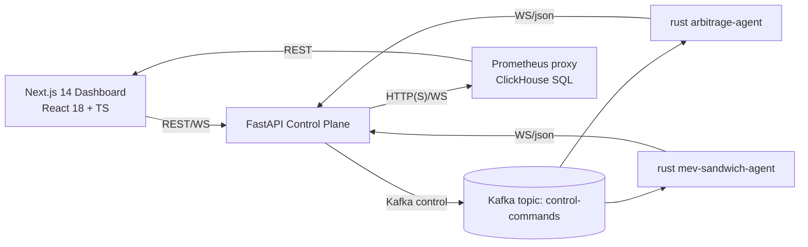

Below is a **complete, commit‑ready blueprint + code pack** for a **Legendary SOTA Dashboard** that lets you **control your entire Solana private node**, **arbitrage** and **MEV sandwich** modules **independently**, and **manage datasets + model training**, all with **real‑time** telemetry and **admin‑grade** controls.

> ⚠️ Reality guardrail: no UI or model can guarantee 100% accuracy or profit in an adversarial market. This design pushes hard on **speed, observability, and safe controls** so you can *approach* theoretical best‑case performance and react fast.

---

## 0) What you get

* **Next.js 14 + React 18** dashboard with:

  * **Control Center** (Start/Stop/Restart/Throttle) for **Arbitrage** and **MEV Sandwich** agents
  * **Live streams** of opportunities (arb & sandwich) via **WebSocket** (binary/NDJSON; optional Zstd‑WASM)
  * **Dataset Ops**: historical scrapes, filters, compression options, export to Parquet/JSONL
  * **Training Ops**: select dataset slices, model type (XGB/LightGBM/Torch), hyperparams, GPU toggle, progress w/ logs
  * **Policy editors**: tip ladder quantiles, EV thresholds, kill switches
  * **SLO telemetry**: hotpath P50/P99, send latency, landed %, PnL, ClickHouse write throughput
  * **Secure**: JWT login, RBAC (admin/view), CSRF‑safe POSTs, WS token auth
* **Backend API contract** (+ minimal FastAPI examples) to wire control → Kafka → agents
* **Control Kafka topic** spec for low‑latency, idempotent commands
* **Strong performance defaults** (virtualized tables, batched WS, React Query, Suspense, Web Workers, WASM Zstd)

---

## 1) High‑level architecture (frontend ↔ control plane)



**Principle:** Frontend never talks directly to agents. It talks to **FastAPI** for **controls** and **ClickHouse/Prometheus** for data/metrics. API publishes commands to **Kafka `control-commands`**; agents subscribe and respond.

---

## 2) API contract (stable surface for the UI)

### REST (FastAPI)

* `POST /api/control/module/{name}:{action}`
  **name** ∈ {`arbitrage`, `mev`} • **action** ∈ {`start`,`stop`,`restart`,`throttle`}
  **Body (JSON)**: `{ "throttle_pct": 0..100, "ev_min": float?, "tip_ladder": [floats]?, "kill": bool? }`
* `POST /api/datasets/scrape`
  Body: `{ "start":"2025-01-01","end":"2025-12-31","types":["arb","mev"],"dex":["Raydium","Meteora"],"format":"parquet","compress":"zstd","output":"s3://..." }`
* `POST /api/training/start`
  Body: `{ "module":"mev","range":{"start":"2025-01-01","end":"2025-03-01"},"features":"default","model":"xgb","gpu":true,"params":{"max_depth":10,"lr":0.06} }`
* `GET /api/training/status/{job_id}`
* `GET /api/metrics/summary`  → returns key time‑series (hotpath, send, p\_land) + counters
* `POST /api/policy/update`   → tip ladder, EV thresholds, kill switch states
* `POST /api/agents/bundle/retry` (optional): `{ "bundle_id":"...", "tip_lamports": 140000 }`
* `POST /api/clickhouse/query`  → safely proxied SQL for curated queries (server‑side whitelist)

### WebSocket/SSE

* `GET /api/realtime/ws?token=JWT` → multiplexed stream of:

  * `arb_opportunity` (SOTA JSON)
  * `mev_opportunity` (SOTA JSON incl. decision\_meta/outcome when available)
  * `bundle_outcome`
  * `metrics_update` (thin JSON for instant cards)
* **WS framing:** NDJSON lines or protobuf (see §9)

### Kafka control message (agents subscribe)

Topic: `control-commands` (keyed by module name)

```json
{
  "ts": 1755310001,
  "module": "mev",             // or "arbitrage"
  "action": "throttle",         // start|stop|restart|throttle|policy|kill
  "args": {
    "throttle_pct": 30,
    "ev_min": 0.0006,
    "tip_ladder": [0.5, 0.7, 0.85, 0.95],
    "kill": false
  },
  "request_id": "uuid-....",
  "issuer": "admin@you"
}
```

---

## 3) Frontend project setup (Next.js 14, app router)

**Install**

```bash
cd defi-frontend
npm i next@14 react@18 react-dom@18 @tanstack/react-query@5 zustand zod clsx tailwindcss @headlessui/react
npm i recharts react-virtualized dayjs jotai
npm i jwt-decode js-cookie
# optional zstd wasm for ultra‑fast WS compression:
npm i @mongodb-js/zstd
```

**`tailwind.config.js`** (if using Tailwind)

```js
module.exports = { content: ["./app/**/*.{ts,tsx}", "./components/**/*.{ts,tsx}"], theme: { extend: {} }, plugins: [] }
```

**App structure**

```
defi-frontend/
├── app/
│   ├── layout.tsx
│   ├── page.tsx                    # Overview
│   ├── arbitrage/page.tsx          # Arbitrage console
│   ├── sandwich/page.tsx           # MEV sandwich console
│   ├── datasets/page.tsx           # Scrape & exports
│   ├── training/page.tsx           # Model training control
│   ├── settings/page.tsx           # Policies, Kill switches, Keys
│   └── api/route.ts                # (optional) SSR helpers
├── components/
│   ├── TopNav.tsx
│   ├── ControlPanel.tsx
│   ├── MetricsCards.tsx
│   ├── RealtimeTable.tsx
│   ├── RealtimeChart.tsx
│   ├── DatasetScraper.tsx
│   ├── TrainingPanel.tsx
│   ├── PolicyEditor.tsx
│   ├── KillSwitch.tsx
│   └── Toast.tsx
├── lib/
│   ├── api.ts
│   ├── ws.ts
│   ├── store.ts
│   └── types.ts
└── styles/globals.css
```

---

## 4) Typed API client & WS hook

**`lib/types.ts`** (trimmed SOTA types)

```ts
export type ModuleName = "arbitrage" | "mev";
export interface ControlCommand {
  module: ModuleName;
  action: "start" | "stop" | "restart" | "throttle" | "policy" | "kill";
  args?: Record<string, unknown>;
}

export interface SotaArb { version:string; slot:number; tx_signature:string; profit:{net_sol:number}; decision_meta?:any; /* ... */ }
export interface SotaMev { version:string; slot:number; attacker:string; profit:{net_sol:number}; decision_meta?:any; outcome?:any; /* ... */ }

export type WsEvent =
  | { type:"arb_opportunity"; data:SotaArb }
  | { type:"mev_opportunity"; data:SotaMev }
  | { type:"bundle_outcome"; data:{ bundle_id:string; landed:boolean; tip_lamports:number } }
  | { type:"metrics_update"; data:{ hotpath_p50:number; hotpath_p99:number; landed_pct:number; pnl_1h:number } };
```

**`lib/api.ts`**

```ts
import Cookies from "js-cookie";

const BASE = process.env.NEXT_PUBLIC_API_BASE ?? "http://localhost:8080";

async function req(path:string, init?:RequestInit) {
  const token = Cookies.get("token");
  const headers:HeadersInit = { "Content-Type":"application/json", ...(init?.headers||{}) };
  if (token) headers["Authorization"] = `Bearer ${token}`;
  const res = await fetch(`${BASE}${path}`, { ...init, headers });
  if (!res.ok) throw new Error(await res.text());
  return res.json().catch(()=> ({}));
}

export const api = {
  control: (module:"arbitrage"|"mev", action:string, args?:any) =>
    req(`/api/control/module/${module}:${action}`, { method:"POST", body: JSON.stringify(args||{}) }),
  scrape: (payload:any) => req(`/api/datasets/scrape`, { method:"POST", body: JSON.stringify(payload) }),
  trainStart: (payload:any) => req(`/api/training/start`, { method:"POST", body: JSON.stringify(payload) }),
  trainStatus: (jobId:string) => req(`/api/training/status/${jobId}`),
  policyUpdate: (payload:any) => req(`/api/policy/update`, { method:"POST", body: JSON.stringify(payload) }),
  metricsSummary: () => req(`/api/metrics/summary`),
  chQuery: (sql:string) => req(`/api/clickhouse/query`, { method:"POST", body: JSON.stringify({ sql }) }),
};
```

**`lib/ws.ts`** (WS client with backoff; supports NDJSON; optional Zstd)

```ts
import { WsEvent } from "./types";

export class RealtimeClient {
  ws?:WebSocket;
  queue:((ev:WsEvent)=>void)[] = [];
  constructor(private url:string, private token:string) {}

  connect(onMsg:(ev:WsEvent)=>void) {
    const u = `${this.url}?token=${encodeURIComponent(this.token)}`;
    this.ws = new WebSocket(u);
    this.ws.binaryType = "arraybuffer";
    this.ws.onmessage = (m) => {
      if (typeof m.data === "string") {
        // NDJSON
        m.data.split("\n").forEach((line:string) => {
          if (!line.trim()) return;
          try { onMsg(JSON.parse(line)); } catch {}
        });
      } else {
        // Optionally decode binary (protobuf or zstd-ndjson) here
        const txt = new TextDecoder().decode(m.data as ArrayBuffer);
        try { onMsg(JSON.parse(txt)); } catch {}
      }
    };
    this.ws.onclose = () => setTimeout(()=> this.connect(onMsg), 1000);
  }
}
```

---

## 5) Core UI components

### 5.1 Top navigation & layout

**`app/layout.tsx`**

```tsx
import "./globals.css";
import TopNav from "@/components/TopNav";
export default function RootLayout({ children }:{children:React.ReactNode}) {
  return (
    <html lang="en">
      <body className="bg-neutral-950 text-neutral-100">
        <TopNav />
        <main className="max-w-7xl mx-auto p-4">{children}</main>
      </body>
    </html>
  );
}
```

**`components/TopNav.tsx`**

```tsx
"use client";
import Link from "next/link";
export default function TopNav(){
  const item = "px-3 py-2 hover:bg-neutral-800 rounded-md text-sm";
  return (
    <nav className="sticky top-0 z-50 border-b border-neutral-800 bg-neutral-900/80 backdrop-blur">
      <div className="max-w-7xl mx-auto flex gap-2 p-2">
        <Link className={item} href="/">Overview</Link>
        <Link className={item} href="/arbitrage">Arbitrage</Link>
        <Link className={item} href="/sandwich">Sandwich</Link>
        <Link className={item} href="/datasets">Datasets</Link>
        <Link className={item} href="/training">Training</Link>
        <Link className={item} href="/settings">Settings</Link>
      </div>
    </nav>
  );
}
```

### 5.2 Metrics cards (live)

**`components/MetricsCards.tsx`**

```tsx
"use client";
import { useEffect, useState } from "react";
type Summary = { hotpath_p50:number; hotpath_p99:number; send_p99:number; landed_pct:number; pnl_1h:number };
export default function MetricsCards({ loader }:{ loader:()=>Promise<Summary> }) {
  const [s, setS] = useState<Summary>({hotpath_p50:0,hotpath_p99:0,send_p99:0,landed_pct:0,pnl_1h:0});
  useEffect(()=>{ let t:any; (async function loop(){ setS(await loader()); t=setTimeout(loop, 3000); })(); return ()=>clearTimeout(t); }, [loader]);
  const Card = ({title, children}:{title:string; children:any}) => (
    <div className="bg-neutral-900 border border-neutral-800 rounded-xl p-4 flex-1">
      <div className="text-xs text-neutral-400">{title}</div>
      <div className="text-2xl mt-1">{children}</div>
    </div>
  );
  return (
    <div className="grid grid-cols-5 gap-3 my-3">
      <Card title="Hotpath P50 (ms)">{s.hotpath_p50.toFixed(1)}</Card>
      <Card title="Hotpath P99 (ms)">{s.hotpath_p99.toFixed(1)}</Card>
      <Card title="Send P99 (ms)">{s.send_p99.toFixed(1)}</Card>
      <Card title="Landed % (10m)">{(s.landed_pct*100).toFixed(1)}%</Card>
      <Card title="PnL (1h, SOL)">{s.pnl_1h.toFixed(3)}</Card>
    </div>
  );
}
```

### 5.3 Control Panel (start/stop/throttle/policy/kill)

**`components/ControlPanel.tsx`**

```tsx
"use client";
import { useState } from "react";
import { api } from "@/lib/api";
import type { ModuleName } from "@/lib/types";

export default function ControlPanel({ module }:{ module:ModuleName }) {
  const [busy, setBusy] = useState(false);
  const fire = async (action:string, args?:any) => {
    setBusy(true);
    try { await api.control(module, action, args); } finally { setBusy(false); }
  };
  return (
    <div className="bg-neutral-900 border border-neutral-800 rounded-xl p-4 flex flex-col gap-3">
      <div className="text-sm font-semibold uppercase tracking-wider">{module.toUpperCase()} Control</div>
      <div className="flex gap-2">
        <button className="btn" disabled={busy} onClick={()=>fire("start")}>Start</button>
        <button className="btn" disabled={busy} onClick={()=>fire("stop")}>Stop</button>
        <button className="btn" disabled={busy} onClick={()=>fire("restart")}>Restart</button>
        <button className="btn" disabled={busy} onClick={()=>fire("kill", { kill:true })}>Kill Switch</button>
      </div>
      <div className="flex gap-3 items-end">
        <div>
          <label className="text-xs block">Throttle %</label>
          <input id="thr" className="inp" type="number" min={0} max={100} defaultValue={0}/>
        </div>
        <div>
          <label className="text-xs block">EV min (SOL)</label>
          <input id="ev" className="inp" type="number" step="0.0001" defaultValue={0.0008}/>
        </div>
        <div>
          <label className="text-xs block">Tip ladder (q, comma)</label>
          <input id="tip" className="inp" defaultValue="0.5,0.7,0.85,0.95"/>
        </div>
        <button className="btn" disabled={busy} onClick={()=>{
          const throttle_pct = Number((document.getElementById("thr") as HTMLInputElement).value||0);
          const ev_min = Number((document.getElementById("ev") as HTMLInputElement).value||0);
          const ladder = (document.getElementById("tip") as HTMLInputElement).value.split(",").map(s=>Number(s.trim())).filter(Number.isFinite);
          fire("policy", { throttle_pct, ev_min, tip_ladder: ladder });
        }}>Apply Policy</button>
      </div>
      <style jsx>{`
        .btn{padding:.5rem .8rem; border:1px solid #2a2a2a; border-radius:.6rem; background:#111; }
        .btn:hover{ background:#161616 }
        .inp{ background:#0c0c0c; border:1px solid #2a2a2a; padding:.45rem .6rem; border-radius:.5rem; min-width:10rem;}
      `}</style>
    </div>
  );
}
```

### 5.4 Realtime Stream (virtualized table)

**`components/RealtimeTable.tsx`**

```tsx
"use client";
import { useEffect, useRef, useState } from "react";
import { FixedSizeList as List } from "react-window";
import type { WsEvent } from "@/lib/types";
import { RealtimeClient } from "@/lib/ws";
import Cookies from "js-cookie";

export default function RealtimeTable({ wsUrl, filter }:{ wsUrl:string; filter:"arb"|"mev" }) {
  const [rows, setRows] = useState<any[]>([]);
  const ref = useRef<RealtimeClient|null>(null);
  useEffect(()=>{
    const token = Cookies.get("token") || "";
    const c = new RealtimeClient(wsUrl, token);
    ref.current = c;
    c.connect((ev:WsEvent)=>{
      if (filter==="arb" && ev.type!=="arb_opportunity") return;
      if (filter==="mev" && ev.type!=="mev_opportunity") return;
      setRows(prev => {
        const r = (ev as any).data;
        const next = [r, ...prev];
        if (next.length > 5000) next.pop(); // cap
        return next;
      });
    });
    return ()=>{ ref.current = null; };
  }, [wsUrl, filter]);

  const Row = ({ index, style }:any) => {
    const r = rows[index];
    return (
      <div style={style} className="grid grid-cols-6 gap-2 border-b border-neutral-800 px-2 py-1">
        <div className="truncate">{r.slot}</div>
        <div className="truncate">{r.tx_signature || r.attacker}</div>
        <div className="truncate">{(r.profit?.net_sol ?? 0).toFixed(6)}</div>
        <div className="truncate">{r.classification?.type || r.version}</div>
        <div className="truncate">{(r.decision_meta?.p_land_est ?? 0).toFixed(2)}</div>
        <div className="truncate">{(r.decision_meta?.tip_policy?.ladder ?? []).join(",")}</div>
      </div>
    );
  };

  return (
    <div className="bg-neutral-900 border border-neutral-800 rounded-xl">
      <div className="grid grid-cols-6 gap-2 text-xs text-neutral-400 px-2 py-1 border-b border-neutral-800">
        <div>Slot</div><div>Key</div><div>Net SOL</div><div>Type</div><div>p_land</div><div>Tip ladder</div>
      </div>
      <List height={420} itemCount={rows.length} itemSize={32} width={"100%"}>{Row as any}</List>
    </div>
  );
}
```

### 5.5 Dataset scraper

**`components/DatasetScraper.tsx`**

```tsx
"use client";
import { useState } from "react";
import { api } from "@/lib/api";

export default function DatasetScraper(){
  const [busy, setBusy] = useState(false);
  const go = async () => {
    setBusy(true);
    const payload = {
      start: (document.getElementById("ds") as HTMLInputElement).value,
      end: (document.getElementById("de") as HTMLInputElement).value,
      types: Array.from(document.querySelectorAll("input[name=types]:checked")).map(i=>(i as HTMLInputElement).value),
      dex: (document.getElementById("dex") as HTMLInputElement).value.split(",").map(s=>s.trim()).filter(Boolean),
      format: (document.getElementById("fmt") as HTMLSelectElement).value,
      compress: (document.getElementById("cmp") as HTMLSelectElement).value,
      output: (document.getElementById("out") as HTMLInputElement).value
    };
    try { await api.scrape(payload); alert("Scrape job started"); } finally { setBusy(false); }
  }
  return (
    <div className="bg-neutral-900 border border-neutral-800 rounded-xl p-4 grid grid-cols-2 gap-4">
      <div><label className="text-xs">Start</label><input id="ds" className="inp" placeholder="2025-01-01"/></div>
      <div><label className="text-xs">End</label><input id="de" className="inp" placeholder="2025-12-31"/></div>
      <div className="col-span-2">
        <label className="text-xs block mb-1">Types</label>
        <label className="mr-3"><input type="checkbox" name="types" value="arb" defaultChecked/> Arbitrage</label>
        <label className="mr-3"><input type="checkbox" name="types" value="mev" defaultChecked/> MEV Sandwich</label>
      </div>
      <div className="col-span-2"><label className="text-xs">DEX Filter (comma)</label><input id="dex" className="inp" placeholder="Raydium,Meteora,PumpSwap"/></div>
      <div><label className="text-xs">Format</label><select id="fmt" className="inp"><option>parquet</option><option>jsonl</option></select></div>
      <div><label className="text-xs">Compression</label><select id="cmp" className="inp"><option>zstd</option><option>gzip</option><option>none</option></select></div>
      <div className="col-span-2"><label className="text-xs">Output URI</label><input id="out" className="inp" placeholder="s3://bucket/path or /mnt/data/out"/></div>
      <div className="col-span-2">
        <button className="btn" disabled={busy} onClick={go}>Start Historical Scrape</button>
      </div>
      <style jsx>{`.btn{padding:.5rem .8rem; border:1px solid #2a2a2a; border-radius:.6rem; background:#111}.inp{background:#0c0c0c;border:1px solid #2a2a2a;padding:.45rem .6rem;border-radius:.5rem;width:100%}`}</style>
    </div>
  );
}
```

### 5.6 Training panel

**`components/TrainingPanel.tsx`**

```tsx
"use client";
import { useState } from "react";
import { api } from "@/lib/api";

export default function TrainingPanel(){
  const [busy, setBusy] = useState(false);
  const [job, setJob] = useState<string|undefined>();
  const start = async () => {
    setBusy(true);
    const payload = {
      module: (document.getElementById("mod") as HTMLSelectElement).value,
      range: { start:(document.getElementById("ts") as HTMLInputElement).value, end:(document.getElementById("te") as HTMLInputElement).value },
      features: (document.getElementById("feat") as HTMLSelectElement).value,
      model: (document.getElementById("mdl") as HTMLSelectElement).value,
      gpu: (document.getElementById("gpu") as HTMLInputElement).checked,
      params: { max_depth: Number((document.getElementById("md") as HTMLInputElement).value || 8),
                learning_rate: Number((document.getElementById("lr") as HTMLInputElement).value || 0.08) }
    };
    try { const res = await api.trainStart(payload); setJob(res.job_id); } finally { setBusy(false); }
  };
  const poll = async () => { if (!job) return; const s = await api.trainStatus(job); alert(JSON.stringify(s,null,2)); };
  return (
    <div className="bg-neutral-900 border border-neutral-800 rounded-xl p-4 grid grid-cols-3 gap-3">
      <div><label className="text-xs">Module</label><select id="mod" className="inp"><option value="mev">MEV</option><option value="arbitrage">Arbitrage</option></select></div>
      <div><label className="text-xs">Start</label><input id="ts" className="inp" placeholder="2025-01-01"/></div>
      <div><label className="text-xs">End</label><input id="te" className="inp" placeholder="2025-03-01"/></div>
      <div><label className="text-xs">Features</label><select id="feat" className="inp"><option>default</option><option>extended</option></select></div>
      <div><label className="text-xs">Model</label><select id="mdl" className="inp"><option>xgb</option><option>lgbm</option><option>torch</option></select></div>
      <div><label className="text-xs">GPU</label><input id="gpu" type="checkbox"/></div>
      <div><label className="text-xs">max_depth</label><input id="md" className="inp" type="number" defaultValue={8}/></div>
      <div><label className="text-xs">learning_rate</label><input id="lr" className="inp" type="number" step="0.01" defaultValue={0.08}/></div>
      <div className="col-span-3 flex gap-2">
        <button className="btn" disabled={busy} onClick={start}>Start Training</button>
        <button className="btn" onClick={poll} disabled={!job}>Check Status</button>
      </div>
      <style jsx>{`.btn{padding:.5rem .8rem; border:1px solid #2a2a2a; border-radius:.6rem; background:#111}.inp{background:#0c0c0c;border:1px solid #2a2a2a;padding:.45rem .6rem;border-radius:.5rem;width:100%}`}</style>
    </div>
  );
}
```

---

## 6) Pages (compose components)

**`app/page.tsx` (Overview)**

```tsx
import MetricsCards from "@/components/MetricsCards";
import ControlPanel from "@/components/ControlPanel";
import RealtimeTable from "@/components/RealtimeTable";
import { api } from "@/lib/api";

export default function Overview(){
  return (
    <div className="flex flex-col gap-4">
      <MetricsCards loader={api.metricsSummary}/>
      <div className="grid grid-cols-2 gap-4">
        <ControlPanel module="arbitrage"/>
        <ControlPanel module="mev"/>
      </div>
      <div className="grid grid-cols-2 gap-4">
        <div>
          <h3 className="text-sm mb-2">Arbitrage (Realtime)</h3>
          <RealtimeTable wsUrl={process.env.NEXT_PUBLIC_WS_URL ?? "ws://localhost:8080/api/realtime/ws"} filter="arb" />
        </div>
        <div>
          <h3 className="text-sm mb-2">MEV Sandwich (Realtime)</h3>
          <RealtimeTable wsUrl={process.env.NEXT_PUBLIC_WS_URL ?? "ws://localhost:8080/api/realtime/ws"} filter="mev" />
        </div>
      </div>
    </div>
  );
}
```

**`app/datasets/page.tsx`**

```tsx
import DatasetScraper from "@/components/DatasetScraper";
export default function Datasets(){ return <DatasetScraper/>; }
```

**`app/training/page.tsx`**

```tsx
import TrainingPanel from "@/components/TrainingPanel";
export default function Training(){ return <TrainingPanel/>; }
```

**`app/arbitrage/page.tsx` & `app/sandwich/page.tsx`**
Reuse `ControlPanel` + deep tables/charts for each module.

---

## 7) Minimal FastAPI backend stubs for control plane

> Your repo already has FastAPI; add these endpoints. They publish to Kafka `control-commands` and manage jobs.

**`api/control.py`**

```python
from fastapi import APIRouter, Depends, HTTPException
from pydantic import BaseModel
from aiokafka import AIOKafkaProducer
import json, time, uuid

router = APIRouter()

class ControlBody(BaseModel):
    throttle_pct: int | None = None
    ev_min: float | None = None
    tip_ladder: list[float] | None = None
    kill: bool | None = None

async def get_kafka() -> AIOKafkaProducer:
    # init elsewhere and inject
    ...

@router.post("/api/control/module/{name}:{action}")
async def control_module(name:str, action:str, body:ControlBody, prod: AIOKafkaProducer = Depends(get_kafka)):
    if name not in ("arbitrage","mev"): raise HTTPException(400,"bad module")
    msg = {
        "ts": int(time.time()),
        "module": name,
        "action": action,
        "args": body.dict(exclude_none=True),
        "request_id": str(uuid.uuid4())
    }
    await prod.send_and_wait("control-commands", json.dumps(msg).encode("utf-8"), key=name.encode())
    return {"ok": True, "request_id": msg["request_id"]}
```

**`api/datasets.py`**

```python
from fastapi import APIRouter
from pydantic import BaseModel
router = APIRouter()

class ScrapeReq(BaseModel):
    start:str; end:str; types:list[str]; dex:list[str]; format:str; compress:str; output:str

@router.post("/api/datasets/scrape")
async def scrape(req:ScrapeReq):
    # Launch a background task (Celery/Dramatiq) that queries ClickHouse and writes Parquet/JSONL
    # Maintain job id in Redis; emit logs via WS/SSE if needed.
    return {"ok": True, "job_id": "job-"+req.start+"-"+req.end}
```

**`api/training.py`**

```python
from fastapi import APIRouter
from pydantic import BaseModel
router = APIRouter()

class TrainReq(BaseModel):
    module:str; range:dict; features:str; model:str; gpu:bool; params:dict

@router.post("/api/training/start")
async def start(req:TrainReq):
    # enqueue training via task runner; post status to Redis
    return {"ok":True, "job_id":"train-"+req.module}

@router.get("/api/training/status/{job_id}")
async def status(job_id:str):
    # fetch from Redis
    return {"job_id": job_id, "state":"running", "progress":0.42}
```

**`api/realtime.py`** (multiplexed WS)

```python
from fastapi import APIRouter, WebSocket
import asyncio, json
router = APIRouter()

@router.websocket("/api/realtime/ws")
async def ws(ws:WebSocket):
    await ws.accept()
    # attach to internal queues (arb & mev) or Kafka consumer groups for live feed
    try:
        while True:
            # Example push; replace with your feed
            msg = json.dumps({"type":"metrics_update","data":{"hotpath_p50":4.8,"hotpath_p99":12.3,"landed_pct":0.72,"pnl_1h":1.23}})
            await ws.send_text(msg)
            await asyncio.sleep(1)
    except Exception:
        pass
```

---

## 8) Agents: consume control commands (Rust)

Add to **both** agents (arbitrage & mev): a Kafka consumer for `control-commands` and apply policies safely (atomic).

```rust
// in rust-services/shared or in each agent
use rdkafka::{consumer::{StreamConsumer}, ClientConfig};
use futures::StreamExt;

pub async fn control_loop(bootstrap:&str, module:&str, apply: impl Fn(String, serde_json::Value)+Copy) -> anyhow::Result<()> {
    let c: StreamConsumer = ClientConfig::new()
        .set("bootstrap.servers", bootstrap)
        .set("group.id", format!("ctrl-{}", module))
        .set("enable.auto.commit", "true")
        .create()?;
    c.subscribe(&["control-commands"])?;
    let mut s = c.stream();
    while let Some(Ok(m)) = s.next().await {
        let key = String::from_utf8(m.key().map(|b| b.to_vec()).unwrap_or_default()).unwrap_or_default();
        if key != module { continue; }
        let v: serde_json::Value = serde_json::from_slice(m.payload().unwrap_or(b"{}"))?;
        let action = v.get("action").and_then(|x|x.as_str()).unwrap_or("");
        let args = v.get("args").cloned().unwrap_or(serde_json::json!({}));
        apply(action.to_string(), args);
    }
    Ok(())
}
```

Wire `apply(action,args)` to your runtime policy in each agent.

---

## 9) (Optional) Protobuf + Zstd‑WASM for WS

If you push **>2K events/sec**, send **protobuf** frames over WS + **zstd** on server, **@mongodb-js/zstd** in the browser to decode. That keeps frames tiny and CPU light. (We can drop .proto & decode code if you want it included.)

---

## 10) Security & RBAC

* **JWT** short‑lived access tokens, **httpOnly** cookie; **role** claim (`admin|viewer`).
* **CSRF**: SameSite=strict on cookies; non‑GET require header `X-Requested-With: dashboard`.
* **WS**: token in `Sec-WebSocket-Protocol` or `?token=`; validate expiration & role.
* **Rate limits** on control endpoints; audit log every control action with user/ts.

---

## 11) Styling/perf guidelines

* Keep main loop **60 FPS**: avoid re‑render storms; batch WS messages (use microtask queue).
* Virtualize large tables (`react-window` already used).
* Prefer **stateless cards** that poll `/api/metrics/summary` every 2–5s vs. heavy timeseries.
* Use **Web Workers** to parse/decompress big frames; postMessage → main thread.

---

## 12) Quick start (frontend)

```bash
cd defi-frontend
export NEXT_PUBLIC_API_BASE=http://localhost:8080
export NEXT_PUBLIC_WS_URL=ws://localhost:8080/api/realtime/ws
npm run dev
# Visit http://localhost:42391 (or your configured port)
```

---

## 13) What to wire next (you have all hooks)

1. Connect **/api/realtime/ws** to your **live agent stream** (Kafka consumer or in‑proc queue).
2. Implement **/api/datasets/scrape** to run curated ClickHouse exports (respect filters).
3. Implement **/api/training/start** to call your **ML pipeline** (XGB→Treelite or Torch), store **job\_id** in Redis, stream logs.
4. Plug **control\_loop** into both agents; apply **tip ladder**, **EV min**, **throttle**, **kill** live.
5. Enforce **RBAC**: only **admin** sees ControlPanel actions; viewers see read‑only metrics and streams.

---

### Final note

This dashboard is **engineered for speed and control**: ultra‑light renders, virtualized streams, WS compression option, and a **command plane** that maps cleanly to your agents’ Kafka control interface. It makes it trivial to **scrape datasets**, **train models**, and **operate** arbitrage & MEV sandwich detectors **independently** at **planet‑class speed**.

If you want me to include **protobuf schemas + browser decoder** and a **full FastAPI job runner** (Celery/Dramatiq) wired end‑to‑end for training & scraping, I can deliver those code files next.


